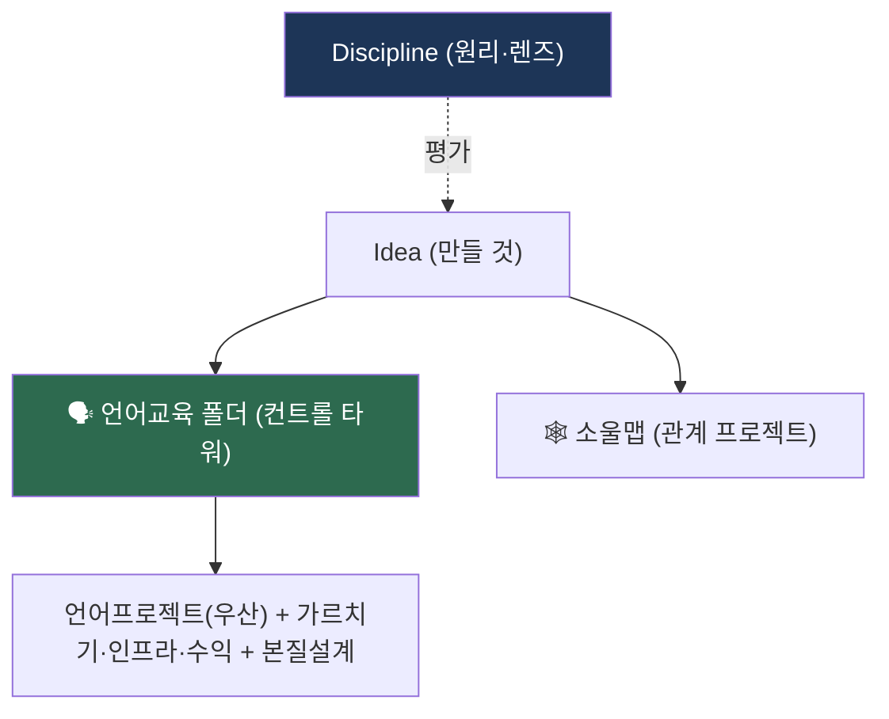

> 📌 **Idea 폴더**: 채연의 *만들 것*(프로젝트 구상). 평가 원리·렌즈·시스템은 `Discipline/`, 이주 행동은 `Plan/`, 자기 인식은 `원채연/`.

---

## 프로젝트 구상

| 구상 | 한 줄 | 위치 |
|------|------|------|
| **🗣 [[언어교육]]** (컨트롤 타워) | 언어 사업 전체 — 배우기·가르치기·인프라·수익 + 본질 설계 + 샘플 | `언어교육/` 폴더 |
| **🕸 [[소울맵-구상]]** | 소울메이트 마인드맵 + 한 장 탭 (반SNS·2촌·초대 전용) | Idea 직속 |

> 언어 관련 모든 문서(언어프로젝트·문화몰입·교환수업·게임·웹·수익화 + 본질 설계)는 **[[언어교육]] 폴더**로 통합. 소울맵만 별개(언어 X).
> 원리·렌즈·시스템 → **[[Discipline]]** / 이주 → `Plan/` / 자기 인식 → `원채연/`

---

## 구조 — 전체 지도



→ **언어 사업 = [[언어교육]] 폴더 단일.** 소울맵 = 별개. 평가는 [[Discipline]].

---

## 평가·실행 토대 → [[Discipline]]

| 종류 | 파일 | 역할 |
|------|------|------|
| 원리 | [[AI역할분리]] | 양도 불가(몰입·관계) 직접 / 복제 가능(콘텐츠·시스템) AI |
| 렌즈 | [[인생도형]] | 순간의 질·시간 (부피 = 몰입×머무름×확장) |
| 렌즈 | [[자본분류-부르디외]] | 가치·자본 (경제·문화·사회·상징·국가 + 전환) |
| 시스템 | [[Minimalism]] | INFJ-T 29행위 5단계 실천 토대 |

→ 구상들은 위 원리·렌즈로 평가·정합 검증됨. (상세 = `Discipline/`)

---

## ★ 부피 × 밀도 평가 (의사결정 렌즈)

> [[인생도형]]을 프로젝트에 적용. **부피 = 규모·도달 / 밀도 = 비휘발(1회 만들면 계속 남고 자생하나).**
> 프로젝트에선 밀도가 *객관 측정* 가능 (재사용·자생·흔적) → 거름망이 단단.

### 평가 3질문

| # | 질문 | 축 |
|:-:|------|:-:|
| 1 | 얼마나 닿나? (사람·규모) | 부피 |
| 2 | 한 번 만들면 계속 남나? | 밀도 |
| 3 | 나 없이도 굴러가나? | 밀도 |

→ 2·3이 No면 부피 커도 **분주한 공허** → 재설계 or 버림.

### 구상 평가

| 구상 | 부피 | 밀도 | 사분면 | 판정 |
|------|:-:|:-:|------|------|
| [[AI역할분리]] | ★★★ | ★★★★★ | 충만 (원리·영구) | 추진 |
| [[언어프로젝트-구상]] | ★★★★ | ★★★★ | **충만** ⭐ | 추진 |
| [[소울맵-구상]] | ★★★ | ★★★★★ | 충만 (자생·흔적) | 추진 |
| [[한국어교환수업-구상]] | ★★ | ★★★★ | 응축 (작아도 자생) | 작게 시작 |
| 막무가내 다언어 (폐기 → [[master-plan-archive]] §N) | ★★★★ | ★★ | **분주한 공허** ⚠️ | 폐기 — 한중일영 4개 깊이로 전환 |

```
        밀도 ↑ (비휘발·자생)
              │
   한국어교환수업  │  AI역할분리·소울맵
   (작아도 영구)  │  언어프로젝트 ⭐
  부피 ──────────┼────────── 부피
              │  막무가내 다언어 ⚠️
              │  (넓으나 휘발)
        밀도 ↓ (휘발·일회성)
```

| 사분면 | 규칙 |
|:-:|------|
| 우상 (부피·밀도 ↑) | 즉시 추진 |
| 좌상 (밀도 ↑·부피 ↓) | 작게 시작 (자생하니 OK) |
| 우하 (부피 ↑·밀도 ↓) | 재설계 or 보류 |
| 좌하 (둘 ↓) | 버림 |

> 핵심: **밀도 0이면 부피 크든 작든 버린다.** 막무가내(우하)는 밀도(남는 자격·산출) 보강 후 추진.

---

## 운영 원칙

1. **Idea = 만들 것** (프로젝트 구상). 새 구상은 `*-구상.md`로 이 폴더에
2. **Discipline/** = 평가 원리·렌즈·시스템 (AI역할분리·인생도형·자본분류·Minimalism)
3. **Plan/** = 이주·행동 마스터플랜 (master-plan-*)
4. **원채연/** = 자기 인식
5. 파일 간 [[wikilink]]는 이름 기반 → 폴더 이동에도 자동 해결
