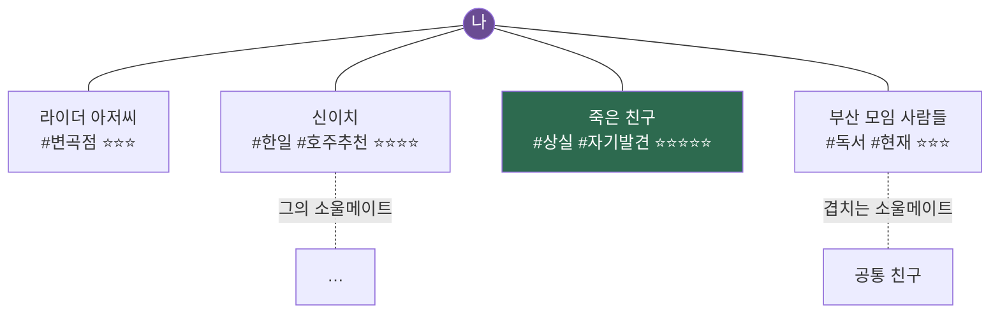
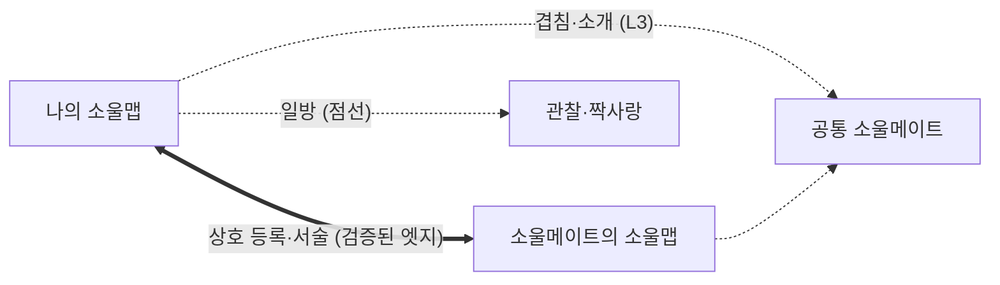
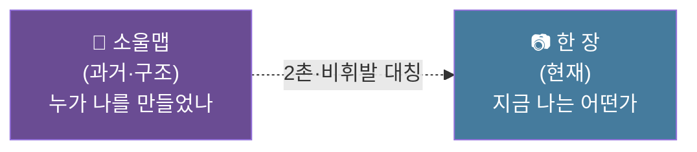

> [!quote] 한 문장
> **나를 만든 사람들(소울메이트)을 마인드맵으로 펼치고, 태그로 그 사람의 특징을 단다. 그리고 소울메이트와 그 지도를 나눈다.**
> SNS가 *넓고 얕은* 관계라면, 소울맵은 *깊고 의미 있는* 관계의 별자리.

> 채연은 이미 [메타 §9] 관계 분류 시스템(7카테고리 + 별점)을 가짐 → 그 데이터를 **시각화 + 공유**로 펼치는 프로젝트.

---

## 1. 핵심 컨셉

| 요소 | 내용 |
|------|------|
| **노드** | 한 사람 = 한 점 |
| **태그** | 그 사람의 특징·관계 유형·의미 |
| **엣지** | 나 ↔ 그 사람 / 그 사람 ↔ 그의 소울메이트 |
| **마인드맵** | 관계의 별자리를 펼쳐 봄 (Obsidian 그래프처럼) |
| **나눔** | 소울메이트와 서로의 지도를 공유 → 소울메이트의 소울메이트 |

→ **소셜 그래프(LinkedIn·인스타)가 아니라 소울 그래프.** 누가 나를 *진짜로 바꿨나*의 지도.

---

## 2. 왜 — 철학·채연 정합

| 근거 | 정합 |
|------|------|
| 메타 §12.1 패턴 3 **"만남에 의한 구원"** | 모든 변곡점에 한 사람 → 그들을 지도화 |
| 메타 §9.3 "자기 서사를 혼자 못 쓴다" | 나를 만든 사람들의 가시화 |
| *"사람은 시이고, 공동체는 시집이다"* (2025.06) | 소울맵 = 사람-시들의 시집 |
| *"한 권의 사람"* (메타 §5.2) | 한 사람 = 한 권 → 태그·메모 |
| 메타 §12.3 **흔적 갈망** | 나를 스쳐간 사람을 기록 = 흔적 |
| 환대 공동체 (자기명시-2) | 사람을 *연결*하는 도구 = 환대 |
| 인생도형 z(확장·관계) | 관계를 펼치고 잇는 = z축 |

→ **반(反)SNS**: 과시·넓이·휘발 대신 **깊이·의미·기억**. 채연 INFJ(소수 깊은 관계)와 정확히 정합.

---

## 3. 노드 구조 (한 사람 = 한 카드)

| 필드 | 예 |
|------|-----|
| 이름/별칭 | 라이더 아저씨 |
| **카테고리** (메타 §9.1) | Play·Life·Dream·Growth·Love·Creative·Business |
| **친밀도** (별점) | ⭐ ~ ⭐⭐⭐⭐⭐ |
| 만난 계기·시기 | 2016 국토대장정 15일차 |
| **특징 태그** | #변곡점 #자유 #첫외부영향 |
| **의미 (한 줄)** | "인생의 주인공은 나" 깨우침 |
| **상호 서술** (§5.2) | 그에 대한 생각·감정 (글) + 그가 본 나 |
| 가입 인증 | 본인 이메일 인증 — 초대 전용 (§5.1) |
| 상태 | 활성 / 휴면 / 상실 |
| (옵션) | 국적·언어·MBTI |

> 태그 = *그 사람이 누구이고 내게 무엇이었나*의 압축. 채연 기존 7카테고리 + 자유 태그.

---

## 4. 시각화 — 관계의 별자리

- **Force-directed 그래프** (Obsidian 그래프 뷰 방식)
- 색 = 카테고리 / 크기 = 친밀도 / 거리 = 가까움
- 클릭 → 그 사람 카드(태그·의미) 펼침
- 시기별 타임라인 모드 (만남의 연대기)

---

## 5. ★ 초대·등록·나누기

### 5.1 진입 = 초대 전용 (희소성)

| 메커니즘 | 설계 |
|------|------|
| **가입** | 초대 전용 — *누군가의 소울메이트*만 진입 (공개 가입 X) |
| **본인 이메일 인증** | 초대받은 본인 계정으로 가입·로그인 → 동의·진정성 자동 |
| **초대권 제한** | 기본 **주 1명** (조절 가능) — 희소성이 신중한 선택 강제 |
| 초대 = 관계 선언 | "당신을 내 소울메이트로 초대" = 고백 수준 의례 |
| **만남 = 가입** | 오프라인 깊은 대화 → 즉석 초대·인증 → 서로 첫 등록 |

> 주 1명 = 1년 52명. **양보다 깊이** — 아무나 못 넣으니 진짜만 넣는다 (Minimalism §1 거절·신중).

### 5.2 ★ 상호 서술 (생각·감정)

| 항목 | 설계 |
|------|------|
| 서술 | 서로에 대한 **생각·감정을 글로** (태그 너머 서사 — "한 권의 사람") |
| **비대칭 허용** | A 길게 / B 짧게 가능 — 관계의 진실 그대로 |
| **동시 공개 잠금** | 둘 다 작성 완료 시 동시 공개 (먼저 안 보기) |
| 공개 단계 | 비공개 / 상대만 / 상호 공개 |

> 상호 공개 = **"서로가 서로를 어떻게 보는가" 나란히** → 페소아 §4 *내가 본 나 ↔ 타인이 본 나* 거울. 자기 인식 도구.

### 5.3 나누기 — 3층 + 상호 등록

| 층 | 방식 | 의미 |
|:-:|------|------|
| **L1 개인** | 나만의 소울맵 (사적) | 기억·감사·자기 서사 (자서전 소재) |
| **L2 1:1 나눔** | 소울메이트에게 *내 지도를 보여줌* | **친밀 의례** — "나를 만든 사람들을 너에게 소개" |
| **L3 네트워크** | 소울맵끼리 연결 → *소울메이트의 소울메이트* | 소울 그래프 — 별자리 확장 |

> **상호 등록 = 검증된 소울메이트 엣지(실선·빛남)** / 일방 = 점선. 쌍방 확인된 관계만 별자리선으로.
> L2 핵심 정서: 자기 소울맵을 보여주는 건 **가장 깊은 자기 노출** — "내가 누구에게 빚졌는가".

### 5.4 ★ 공개 범위 — 2촌 법칙

> 모든 접근에 **관계 경로**가 존재. 던바·신뢰 반경의 디지털 구현 (낯선 접근 원천 차단).

| 촌수 | 관계 | 공개 |
|:-:|------|:-:|
| 1촌 | 내 소울메이트 | ✓ 전체 |
| **2촌** | 소울메이트의 소울메이트 | ✓ 프로필·한 장 (공통 1촌 경유) |
| 3촌+ | — | ✗ 안 보임 |

- **중간 건너뛰기 차단**: 3촌에 닿으려면 *그 사이 1촌이 되어야* 함 (초대·등록). 확장은 한 칸씩 진짜 관계로만.
- **공통 소울메이트 라벨**: 2촌 항목에 "○○를 통해 연결" → 관계 경로 가시화.
- **최초 매개만**: 한번 연결되면 *독립* — 중간 1촌과 멀어져도 끊기지 X. 관계는 끊겨도 **기록은 남김** (메타 §9.2 상실 노드).

### 5.5 ★ "한 장" 탭 — 지금의 나

> SNS의 중력을 *구조*로 차단: **딱 사진 1장 + 짧은 글**, 2촌까지, 비휘발.

| 항목 | 설계 |
|------|------|
| **사진** | 딱 **1장** (현재형 — 새로 올리면 이전 사라짐) |
| **글** | 짧은 단상 (280~500자) — 장문 X |
| 공개 | **2촌까지** (소울맵과 동일 반경) |
| **좋아요·댓글 X** | 반응은 직접(DM·만남) — 과시·알고리즘 차단 |
| 교체 빈도 | 자유 (강제 X — 머무름 존중) |
| 이전 한 장 | 본인만 비공개 보관 (남에겐 *현재*만) |

> **"딱 1장"이 신중·머무름·미니멀을 강제** (Minimalism 1 in/1 out · 인생도형 x 머무름 · 페소아 "진보 X 여행" 현재성). 두 탭 = 과거(별자리) ↔ 현재(한 장) 대칭.

---

## 6. 기술 — AI·웹 (AI역할분리 정합)

| 모듈 | AI 역할 | 직접 |
|------|--------|------|
| 태그 제안 | 메모 → 특징 태그 자동 추천 | 최종 태그·의미는 직접 |
| 그래프 렌더 | force-directed 자동 배치 | — |
| 연결 통찰 | "이 둘은 #도전 공유" 패턴 발견 | 관계 해석은 직접 |
| 회상 프롬프트 | "이 사람과 마지막 만남?" 리마인더 | 실제 연락은 직접 |
| 프라이버시 가드 | 공유 범위·익명화 자동 | — |

→ **AI = 지도 그리기 도구 / 관계 자체는 직접** (AI역할분리 §8 한계선).

---

## 7. ⚠️ 프라이버시 (필수)

| 원칙 | 이유 |
|------|------|
| **초대 전용 + 본인 인증** | 동의한 본인만 등록 — 일방 등록·가짜 차단 |
| **2촌 공개 한계** | 3촌+ 안 보임 — 모든 접근에 관계 경로 강제 |
| **기본 비공개** | 실존 인물 데이터 — 민감 |
| **상호 서술 동시 공개 잠금** | 먼저 안 보기 — 한쪽 유리·눈치 방지 |
| **좋아요·알고리즘 X** | 과시·중독 구조 원천 차단 |
| 별점·험담 태그 금지 설계 | 평가 도구로 변질 방지 (긍정·의미만) |
| 본인 삭제·탈퇴권 | 언제든 자기 노드 제거 |

> 소울맵은 *감사·기억*의 도구지 *평가·관리*의 도구가 아니다 — 이 선이 무너지면 프로젝트 실패.

---

## 8. MVP — Obsidian부터

> 채연은 이미 Obsidian + 메타 §9.2 핵심 인물 데이터 보유 → **웹 전에 Obsidian에서 프로토타입.**

| 단계 | 할 일 |
|:-:|------|
| 1 | 인물별 노트 1장씩 (이름·카테고리·별점·태그·의미) |
| 2 | Obsidian 그래프 뷰 = 즉석 소울맵 (이미 됨) |
| 3 | 태그 체계 정착 (7카테고리 + 자유 태그) |
| 4 | 1명에게 L2 나눔 실험 (친밀 의례) |
| 5 | 반응 좋으면 → 웹 버전 (AI역할분리 ③ 인프라) |

→ **코드 0으로 지금 시작 가능** (Obsidian 그래프). 웹은 검증 후.

---

## 9. 자본·기여 정합

| 프레임 | 의미 |
|------|------|
| 부르디외 | **사회 자본의 가시화·전환** — 관계를 의식적 자산으로 |
| 인생도형 | z축(관계 확장) 도구 — 깊은 관계를 펼치고 잇기 |
| 기여 | L3 = 사람을 연결(소개) = 환대 / 반SNS = 깊은 관계 문화 기여 |
| AI역할분리 | 도구(A) + 자생 플랫폼(B) 둘 다 가능 |
| 자서전 | 소울맵 = 자서전의 *인물 지도* (narrative 소재) |

---

## 10. 메타 위치

| 출처 | 관계 |
|------|------|
| [[원채연/메타프로필]] §9 관계 분류 | 소울맵의 태그 체계 원천 (7카테고리·별점) |
| [[원채연/메타프로필]] §12.1 패턴 3 | "만남에 의한 구원" = 소울맵의 철학 |
| [[AI역할분리]] | 웹·AI 인프라 = ③ 모듈 |
| [[인생도형]] §1 z(관계) | 관계 확장의 도구 |
| [[원채연/자서전-v0]] | 소울맵 = 자서전 인물 지도 |

→ **소울맵 = 채연의 "만남에 의한 구원"을 시각화·공유하는 반SNS 프로젝트.** 나를 만든 사람들의 별자리를, 소울메이트와 나눈다.
