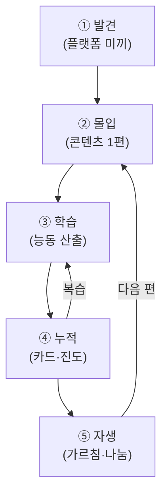

> 🎯 **가장 안 흔들리는 본질.** 플랫폼·디자인 변해도 이 여정은 불변.

---

## 1. 전체 여정 (5단계)

| 단계 | 학습자 상태 | 장치 | 인생도형 |
|:-:|------------|------|:-:|
| ① 발견 | "오 뭐지" | 숏폼·번역안되는말 | 부피(도달) |
| ② 몰입 | "이 세계 좋다" | 여행시뮬·영상·오감 | 밀도 시작 |
| ③ 학습 | "할 수 있다" | 미션·퀴즈·녹음 | 밀도 |
| ④ 누적 | "쌓인다" | 카드·진도·컬렉션 | 지속(x) |
| ⑤ 자생 | "가르치고 싶다" | 교환수업·UGC | z 확장 |

---

## 2. 4 전달 원리 (모든 콘텐츠 통과)

| 원리 | 뜻 | 반대 (피함) |
|:-:|------|------|
| **몰입 우선** | 경험하게 | 공부시키기 |
| **능동 산출** | 하게 | 보게만 |
| **맥락 고정** | 장면=표현=장소 | 단어 암기 |
| **감각 압도** | 5감 | 텍스트만 |

→ 콘텐츠 1편 = 이 4원리 + 5블록([[_템플릿]]).

---

## 3. 진입 경로 3 (비선형 + 선형)

| 경로 | 누구 | 진입 |
|:-:|------|------|
| **장소** | 여행·덕질 | "도쿄" → 컬렉션 |
| **관심** | 음악·인물 팬 | "사카모토" → 위인 산책 |
| **레벨** | 체계 원함 | N5→N4 순서 |

→ 덕질로 들어와도 뒤에서 [[_커리큘럼]]이 받침.

---

## 4. 이어짐 (콘텐츠 간)

| 장치 | 작동 |
|:-:|------|
| 추천 | 본 것·약점 → 다음 편 (초기 수동, 나중 AI) |
| 컬렉션 진척 | "야네센 3/5" 수집 동기 |
| 카드 누적 | 표현 단어장 쌓임 → 복습 |
| 미션 체인 | 산출 → 교환수업 → 다음 |

---

## 5. 학습 메커니즘 4 (③④에서)

| 메커니즘 | 장치 |
|:-:|------|
| 간격 반복 | AI Anki 카드 |
| 능동 인출 | 퀴즈·녹음 |
| 출력→교정 | 산출 → 피드백 |
| **가르치며 배움** | 교환수업 상호 교수 (최강) |

---

→ **여정 = 발견→몰입→학습→누적→자생.** 이 위에 콘텐츠를 얹는다. ([[_템플릿]]·[[_커리큘럼]])
