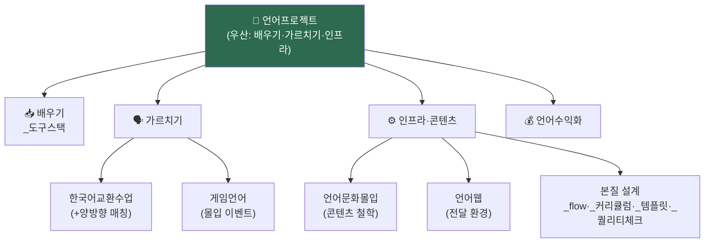

> 🗼 **언어 사업 전체 한눈 + 위계 + 지금 할 일.** 모든 언어 구상·설계의 단일 컨트롤. (관계 프로젝트 [[소울맵-구상]]은 별개 — Idea 직속)

---

## 1. 🗺️ 전체 지도 (위계)

→ **언어프로젝트 = 최상위 비전.** 나머지는 그 아래 *배우기·가르치기·인프라·수익* 4갈래. (위계 모호 해소)

---

## 2. 구상 문서 (위계별)

| 층 | 문서 | 한 줄 |
|:-:|------|------|
| **🌂 우산** | [[언어프로젝트-구상]] | 배우기 ② 가르치기 ③ 인프라 순환 (전체 비전) |
| 📥 배우기 | [[_도구스택]] | AI·인풋·사람·몰입 4층 학습 도구 |
| 🗣 가르치기 | [[한국어교환수업-구상]] | 비상업·교환·교학상장 + §12 양방향 매칭 |
| 🗣 가르치기 | [[게임언어-구상]] | 게임 몰입 이벤트 (어몽·마크·Gartic) |
| ⚙️ 인프라 | [[언어문화몰입-구상]] | 차별화 — 문화·여행시뮬·오감·작품·5축 |
| ⚙️ 인프라 | [[언어웹-아키텍처-구상]] | 독자 웹(MD·Astro) + 플랫폼 연결 |
| 💰 수익 | [[언어수익화-구상]] | 무료 도달 → 유료 전환 (3단계·챌린지) |

---

## 3. 본질 설계 (먼저 단단히 — 흔들림 0)

| 문서 | 역할 |
|------|------|
| [[_flow]] | 학습 여정 (발견→몰입→학습→누적→자생) |
| [[_커리큘럼]] | 레벨 × 기능·문화 이중 축 |
| [[_템플릿]] | 콘텐츠 1편 5블록 + MD 양식 |
| [[_퀄리티체크]] | "이용 가능" 선 (완벽 X) |
| [[_도구스택]] | 학습 도구 4층 |

## 4. 샘플 (실물)

| 언어 | 콘텐츠 |
|------|------|
| 일본어 | [[야네센]] (첫 편 — _템플릿 검증 ✅) |

---

## 5. ★ 현황 + 지금 할 일 (단일 우선순위)

| 단계 | 상태 |
|:-:|:-:|
| 본질 설계 (_flow·커리큘럼·템플릿·퀄·도구) | ✅ 완료 |
| 샘플 1편 (야네센) | ✅ 완료 |
| 콘텐츠 5~10편 | ⬜ **← 지금** |
| 첫 수익 (Anki 덱) | ⬜ |
| 플랫폼·명단·챌린지 | ⬜ |
| 웹 (Astro) | ⬜ (콘텐츠 검증 후) |

> 🎯 **지금 할 일 1개**: 야네센 외 **콘텐츠 4~5편 더** (_템플릿대로) → "이용 가능 퀄" 쌓기.
> 그 다음: 야네센 → Anki 덱 ([[언어수익화-구상]] §5 첫 수익).

---

## 6. 원칙

1. **본질(설계) 먼저 → 콘텐츠 → 수익 → 웹** (순서 고정)
2. **완성 ≠ 완벽** — 이용 가능 퀄([[_퀄리티체크]]) 넘으면 출시, 감각은 평생 다듬기
3. **표준 MD** (Obsidian → Astro 자동) — 코딩은 콘텐츠 검증 후
4. **AI 초안 / 채연 감수·감각·관계** ([[AI역할분리]])
5. **한국 몰입기 = 씨앗** (부업·검증·명단) / 본격 수익 = 이주 후 (디지털 = 장소 무관)

---

→ **언어교육 폴더 = 언어 사업 전체.** 우산(언어프로젝트) 아래 배우기·가르치기·인프라·수익 + 본질 설계 + 샘플. 지금 = 콘텐츠 쌓기.
