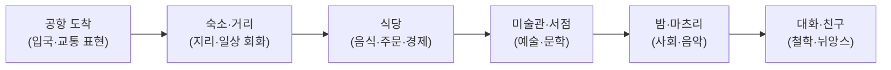

> [!quote] 강점 한 줄
> **언어만 가르치지 않는다 — 그 나라를 *살게* 한다.**
> 자체 교재 + 학습관리 시스템 + **문화 통째 몰입**(지리·문학·경제·사회·철학·예술) + **여행 시뮬레이션** 중심 + **오감 자극 콘텐츠**.

> 남들(앱·교재)은 *문장*을 판다. 우리는 *세계*를 판다. → 흉내 불가능한 차별화.

---

## 1. 차별화 4기둥

| 기둥 | 내용 | 남들 |
|:-:|------|------|
| **① 자체 교재** | 우리만의 커리큘럼·교재 (AI 생성 + 채연 감수) | 기성 교재 라이선스 |
| **② 학습관리 시스템** | 진도·약점·복습·동기 자동 추적 | 단순 강의 나열 |
| **③ 문화 통째 몰입** | 언어 + 지리·문학·경제·사회·철학·예술 | 회화·문법만 |
| **④ 오감 콘텐츠** | 보고·듣고·느끼는 감각 압도 | 텍스트·음성 |

→ 핵심: **언어 = 문으로, 그 너머 세계 전체를 쉽고 재밌게.**

---

## 2. ★ 문화 통째 몰입 (예: 일본어)

> 언어 학습자에게 그 나라를 *넓고 다양하게, 단 쉽고 재밌게*.

| 영역 | 일본 예시 (쉽고 재밌게) |
|------|------------------------|
| **지리** | 47개 도도부현, 후지산·세토내해 — 지도 위 여행 |
| **문학** | 하루키·소세키·하이쿠 — 한 문장씩 맛보기 |
| **경제** | 라멘 한 그릇 가격으로 보는 물가·엔화 |
| **사회** | 혼네·다테마에, 마츠리, 전철 문화 |
| **철학** | 와비사비·모노노아와레 — 미의식 |
| **예술 (음악)** | 시티팝·사카모토 류이치·J-pop |
| **예술 (미술)** | 우키요에·안도 다다오 건축 |
| **예술 (영상)** | 지브리·고레에다·일본 광고 미학 |

→ 채연 자산 직결: 메타 §4 프레임·§6 사상가(사카모토·안도 다다오 동일시)·다국어 소양이 *그대로 콘텐츠*.

---

## 3. ★ 여행 시뮬레이션 (몰입의 축)

> 모든 걸 **여행으로 엮음** — "도쿄 3박 4일"을 살며 언어·문화 동시 습득.



| 여행 단계 | 언어 | 문화 | 오감 |
|:-:|------|------|------|
| 공항·교통 | 입국·길묻기 | 전철 시스템 | 안내방송 소리 |
| 식당 | 주문·계산 | 음식·물가 | 라멘 비주얼·소리 |
| 거리·서점 | 일상 회화 | 지리·문학 | 거리 풍경·BGM |
| 미술관 | 감상 표현 | 예술·철학 | 작품 이미지 |
| 밤·축제 | 친교 회화 | 사회·음악 | 불꽃·마츠리 영상 |

→ **시뮬 = "배운다"가 아니라 "간다".** 흥미·맥락·기억 모두 폭증.

---

## 4. ★ 오감 자극 — 감각적 센스로 압도

> 콘텐츠 제작 원칙: **항상 오감을 건드린다.** 텍스트 X, 경험.

| 감각 | 콘텐츠 장치 |
|:-:|------------|
| 👁 시각 | 영화 같은 비주얼·타이포·색감 (거리·음식·작품) |
| 👂 청각 | 현지 소리·BGM·발음 오디오 (시티팝·안내방송·빗소리) |
| 👅 미각 | 음식 묘사·레시피·"먹는 표현" (군침 도는 비주얼) |
| 🤚 촉각 | 질감·날씨·계절 묘사 (다다미·벚꽃·온천) |
| 👃 후각 | 향 묘사 (장맛·향·거리 냄새) |
| 💗 정서 | 그 순간의 *기분* — 향수·설렘 (인생도형 밀도) |

→ **압도 = 한 콘텐츠를 보면 *그곳에 있는 느낌*.** 채연 미적 감수성(메타 §7.3 메타포·§8.2 미적 실천) = 무기.

---

## 5. ★ 기존 영상 활용 — 임베드 + 학습 레이어

> 자체 제작보다 **빠르고 강력.** 일본 영상미(오감)는 세계 최고 — *직접 만들기보다 빌려서 학습 렌즈로 재가공*.

| 방식 | 저작권 | 채택 |
|:-:|------|:-:|
| 영상 재업로드 | ❌ 침해 | X |
| **임베드 + 별도 학습자료** | ✅ 합법 | **주력** ⭐ |
| 짧은 인용+논평 | △ 공정이용 회색 | 제한적 |
| 라이선스·제휴 | ✅ | 장기 |

### 영상 위 "학습 레이어" (= 내 상품)

```
기존 영상 (유튜브 임베드, 무료·오감 완성)
   + 채연 레이어 (저작권 내 것)
   ├ 타임스탬프별 표현·자막
   ├ 핵심 표현 카드 (AI→Anki)
   ├ 문화 노트 (왜 이 장면)
   └ 발음·섀도잉·미션
```

→ 영상 = *오감 소재*(원작자), 레이어 = *내 상품*(언어·문화·설계). **영상 제작 부담 0 → 하루 여러 편 큐레이션.**

| 영상 유형 | 학습 |
|------|------|
| V-log·산책·먹방 | 일상 회화·자연 발화 (여행 시뮬과 일치) |
| 광고·CM | 압축 표현·정서·영상미 |
| 드라마·애니 클립 | 감정·뉘앙스·문화 코드 |
| 요리·ASMR | 동작·의성어·미각 소리 |

> ⚠️ 경계: 임베드만(재업 X) · 안정 채널 위주 · 표현 카드는 영상 독립 보관 · 수익화 시 라이선스 명확화.

---

## 6. ★ 장소 컬렉션 — 場(마) 단위 묶음

> 문법·레벨이 아니라 **"한 장소"를 축으로** 영상·문학·표현·문화를 한 컬렉션에. 채연 場 사상의 콘텐츠화 — *양도 불가 형식*.

```
📍 야네센 (한 장소)
 ├ 🎬 영상: 산책 V-log·고양이 마을 (임베드)
 ├ 📖 문학: 모리 오가이 「雁」 (이 동네 배경)
 ├ 🗣 표현: 그곳에서 쓰는 말
 ├ 🎴 문화: 시타마치·모노노아와레
 └ 🎨 감각: 노을 계단·간장향·재즈 다방
```

### 채연 사상 정합 (場)

| 자산 | 정합 |
|------|------|
| 메타 §4 프레임 4 **인간/공간/場** | 컬렉션 = 場의 학습화 |
| *"사람은 공간이다"* / *"공간이 스스로 말하게"* (안도 다다오) | 장소가 언어·문화를 말함 |
| *"공간은 감정이 흐르는 필터"* | 컬렉션 = 정서의 그릇 |

### 컬렉션 = 영상 + 문학 시너지

| | 영상 | 문학 |
|---|------|------|
| 준다 | 오감·현재·생생 (부피) | 정서·깊이·상상 (밀도) |

→ 영상으로 *가고*, 문학으로 *머문다*. ([[인생도형]] 부피×밀도)

### ★ 작품 레이어 — 세이치준레이(聖地巡礼)

> 실제 지역 기반 작품(애니·드라마·영화·문학)이 압도적. **작품 = 그 지역으로 드는 문.** 팬의 성지순례 = 최강 동기.

| 작품 | 실제 무대 | 학습 진입 |
|------|----------|----------|
| 너의 이름은 | 도쿄 스가신사·기후 히다 | 계단·시골 풍경 |
| 슬램덩크 | 가마쿠라 에노덴 건널목 | 바다·열차 |
| 센과 치히로 | 도고온천·지우펀(대만) | 온천·골목 |
| 고독한 미식가 | 도쿄 실제 식당 | 먹방·동네 회화 |
| 심야식당 | 신주쿠 골목 | 서민·음식 |

**양방향 매핑** (둘 다 컬렉션):
```
장소 → 작품:  "야네센" → 이 동네 나온 작품들
작품 → 장소:  "너의 이름은" → 실제 가볼 곳들 (성지순례)
```

→ 진입점 = **학습자가 좋아하는 작품**(덕질) → 그 지역·언어로. 기억 3중 고정(장면=표현=장소). 임베드·인용 모델(§5) 동일.

### ★ 역발상 — 부산(내 거주지) 무대 외국 콘텐츠

> 한국어 교환수업의 **즉석 교재**: *외국 작품이 그린 부산*을 한국어 학습자에게.

| 활용 | 내용 |
|------|------|
| **부산 배경 외국 콘텐츠 수집** | 부산 그린 영화·드라마·V-log·여행기 (일·중·영·외국 유튜버) |
| **외국인 시선의 부산** | "외국 작품이 본 부산" = 학습자 친숙 진입 (자국 작품으로 부산 만남) |
| **내가 직접 안내** | 채연 거주지 = *실제 데이터* → 작품 vs 진짜 비교·해설 |
| **상호 교수** | 외국인에 부산(한국어) / 그 작품 출신국 언어 교환 |

→ 부산 = **내가 사는 場 = 살아있는 교재.** 일본어 학습자엔 "일본 영화 속 부산", 영어권엔 "외국 유튜버의 부산" → 그 자국 콘텐츠로 부산·한국어 진입. [[한국어교환수업-구상]] 직결.

### 예시 컬렉션 4

| 컬렉션 | 영상·작품 | 문학 | 핵심 |
|--------|------|------|------|
| 📍 야네센 (옛 도쿄) | 산책 V-log·고양이 마을 | 모리 오가이 「雁」 | 시타마치 정취 |
| 📍 가마쿠라 (바다·절) | 슬램덩크·에노덴 | 가와바타 「山の音」 | 자연·불교·계절 |
| 📍 교토 기온 (전통) | 게이샤·새벽 골목 | 다니자키 「細雪」 | 격식·미의식 |
| 📍 **부산 (내 거주·역발상)** | 외국 작품 속 부산·유튜버 | — | **외국 시선 + 내 안내** ⭐ |

→ **도시·동네 1개 = 1컬렉션.** 무한 시리즈 + 한중일영 + **부산(역방향)**.
→ 두 축: **여행 시뮬(동선·간다)** + **장소 컬렉션(공간 깊이·안다)** / 작품 = 場으로 드는 문. 場 사상이 관통.

---

## 7. ★ 콘텐츠 시리즈 5축

> 공간(여행·장소) 외에 **말·음악·계절·참여·사람**으로 다채널. 각 축 = 무한 시리즈, 한중일영 복제.

| 축 | 한 줄 | 묶는 것 | 채연 자산 |
|:-:|------|--------|----------|
| **A 번역 안 되는 말** | 그 언어만의 단어 | 언어=세계관 | 다국어 + 메타 §7 어휘 3층 |
| **D 한 곡으로 배우기** | 가사·음악으로 언어+정서 | 청각·감성 | 사카모토 류이치 동일시(§6) |
| **F 계절 컬렉션** | 벚꽃·장마·단풍·눈 | 미의식·자연 | 계절 메타포·모노노아와레(§4) |
| **H 내 동네 번역** | 학습자가 자기 동네 소개 | UGC·상호 교수 | 교환수업 자생 |
| **I 위인 산책** | 그 나라 위인의 삶·場·사상 | 인물=문화 맥락 | 메타 §6 Top10 사상가 ⭐ |

### A. 번역 안 되는 말

| 언어 | 예 |
|------|-----|
| 한 | 눈치·정·한 |
| 일 | もののあわれ·侘び寂び·木漏れ日 |
| 영 | serendipity·petrichor |
| 중 | 缘分·江湖 |

→ 단어 1개 = 그 문화의 세계관. 인스타·책·카드.

### D. 한 곡으로 배우기

가사 1곡 → 표현·문법·정서·시대. 시티팝·J-pop·민요. **음악이 오감·감정을 이미 함** → 기억 고정.

### F. 계절 컬렉션

벚꽃(설렘·무상)·장마(센티)·단풍(쓸쓸)·눈(고요). **계절 × 장소 × 표현 × 작품.** 일본 미의식의 핵.

### H. 내 동네 번역 (UGC·자생)

학습자가 *자기 동네*를 배우는 언어로 소개 → 상호 교수 + 콘텐츠 자가 증식 ([[한국어교환수업-구상]] 미션 연결).

### ★ I. 위인 산책 (작가 → 위인 격상)

> 작가만이 아니라 **그 나라를 만든 사람**(사상가·예술가·기업가·혁명가)의 삶·場·사상으로 문화 맥락 통째.

| 유형 | 일본 예 | 배우는 것 |
|:-:|--------|----------|
| 사상가 | 후쿠자와 유키치·니시다 기타로 | 근대·철학 |
| 예술가 | 사카모토 류이치·미야자키·안도 다다오 | 음악·영상·건축 |
| 문호 | 소세키·다자이·미시마 | 문학·정신 |
| 기업가 | 혼다·소니 모리타 | 경제·전후 |
| 역사 | 사카모토 료마·메이지 인물 | 근대화 |

```
한 위인
 ├ 🚶 그가 걸은 場 (생가·활동지 — §6 장소 연결)
 ├ 📖 그의 말·작품 (A·D 연결)
 ├ 🎴 그가 산 시대 (사회·역사)
 ├ 🗣 관련 표현 (분야 어휘)
 └ 💗 왜 위대한가 (정서·존경)
```

→ **"이 사람을 알면 그 나라가 보인다."** 위인 = 場+말+음악+시대+사람 → 5축 수렴. 채연이 *사상가를 동일시*해온 사람(메타 §12.3)이라 **위인 산책 안목 = 양도 불가.**

### 부피×밀도

| 축 | 차별 | 밀도 | 즉시 |
|:-:|:-:|:-:|:-:|
| A | ★★★★★ | ★★★★★ | 지금 |
| I | ★★★★★ | ★★★★★ | 곧 |
| D | ★★★★ | ★★★★ | 지금 |
| F | ★★★★ | ★★★★ | 계절 맞춰 |
| H | ★★★ | ★★★ (자생) | 교환수업 시 |

→ 모두 1회 제작·영구·한중일영 복제. H는 학습자가 만듦(UGC 자생).

---

## 7. 자체 교재 + 학습관리 (AI 인프라)

| 시스템 | AI 역할 | 차별 |
|------|--------|------|
| **자체 교재** | 여행 시뮬 단계별 교안·표현·문화 노트 자동 생성 | 우리만의 커리큘럼 |
| **학습관리** | 진도·약점·복습 주기·동기 추적 | 데이터 기반 개인화 |
| **오감 자산** | 이미지·오디오·영상 큐레이션·생성 | 감각 콘텐츠 라이브러리 |
| **다국어 변환** | 한 콘텐츠 → 4언어 (한중일영) | 시장 4배 |

→ [[AI역할분리]]: 생성·관리 = AI / **감각·목소리·문화 큐레이션 = 채연** (양도 불가 강점).

---

## 6. 왜 이게 강점인가 (부피×밀도)

| 차원 | 평가 |
|:-:|------|
| **차별화** | 언어+문화+여행+오감 = 흉내 불가 (앱은 문장만) |
| **밀도** | 교재·오감 자산 = 1회 제작 후 영구 ([[인생도형]] 비휘발) |
| **채연 정합** | 다국어 + 미적 감수성 + 사상 소양 + 여행 경험 모두 직결 |
| **확장** | 일본어 모델 → 영·중·한 복제 (한중일영 4개) |
| **커뮤니티** | 문화 몰입 = 깊은 관계·환대 ([[한국어교환수업-구상]]) |

---

## 7. 실행 (Phase)

| Phase | 할 일                                   |
| :---: | ------------------------------------- |
|   0   | "도쿄 1일" 여행 시뮬 1개 + 오감 콘텐츠 시범 제작 (일본어) |
|   1   | 교재·학습관리 템플릿화 (AI 파이프라인)               |
|   2   | 한중일영 4개 복제 + 커뮤니티 연동 (교환수업)           |
|   3   | 유료 멤버십·강의·플랫폼 (수익)                    |

→ **MVP = 일본어 "여행 시뮬 1일" + 오감 콘텐츠 1편.** 강점 검증부터.

---

## 8. 메타 위치

| 출처 | 관계 |
|------|------|
| [[언어프로젝트-구상]] §4 ③인프라 | 본 페이지가 인프라를 "문화·여행·오감"으로 격상 |
| [[한국어교환수업-구상]] | 문화 몰입 = 교환수업 콘텐츠 |
| [[AI역할분리]] | 생성·관리 AI / 감각·문화 직접 |
| [[인생도형]] §9 | 언어=충만체 + 오감=밀도(현재를 그대로) |
| 메타프로필 §4·§7·§8 | 채연 미적 감수성·메타포·사상 = 콘텐츠 무기 |

→ **강점 = "언어가 아니라 세계를 판다."** 자체 교재·학습관리(시스템) + 문화 통째·여행 시뮬(몰입) + 오감 압도(감각). 앱·교재가 못 따라오는 차별화.
