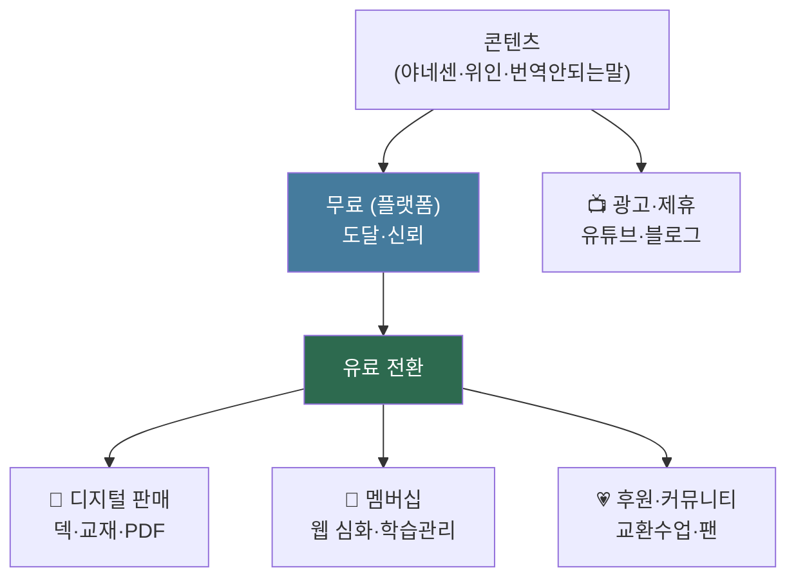

> [!quote] 원칙 (자기명시-2)
> **"돈 벌려고 커뮤니티 만드는 게 아니라, 커뮤니티 지탱하려 돈 번다."**
> 수익 = 직접 영역(몰입·관계) 지탱 수단. **자동·관계형(1회 제작·자생) 우선 / 시간 파는 것(튜터링) 최소.**

> 핵심 공식: **무료 콘텐츠로 팬 → 유료 심화·편의·관계로 전환.** 콘텐츠 = 마케팅이자 제품.

---

## 0. ★ 타겟 3단계 진화 (시장 결정)

> 수익화의 첫 결정 = *누구에게.* 강점·밀도순으로 3단계.

| 단계 | 타겟 | 채연 상태 | 시작 조건 |
|:-:|------|----------|----------|
| **1차** | **한국인 → 일본어** | N1 + 일본 문화 + **언어 커뮤니티 활동 중** ✅ | 지금 |
| **2차** | **외국인 → 한국어** | 교환수업 시도 | 1차 검증 후 |
| **3차** | **학습자끼리 잇기** | 매칭·커뮤니티 플랫폼 | 1·2차 풀 형성 |

### ★ 콜드스타트 면제 (최대 우위)

> 수익화 최대 난관 = "첫 청중 0명". **채연은 이미 일본어 커뮤니티 활동 중 = 그 난관 해결됨.**

| 일반 크리에이터 | 채연 (1차) |
|----------------|-----------|
| 0명부터 명단 (1~2년) | **이미 관계·신뢰 있는 커뮤니티** |
| 콜드스타트 | 첫 콘텐츠부터 반응 |

→ **1차 = 청중 있는 곳부터.** 90일 로드맵(§9.4)을 *현실*로 만드는 핵심. 깔때기 "명단 0 가정" → *커뮤니티 기반*으로 단축.

### 3차 = 場·환대 정점 (= [[한국어교환수업-구상]] §12 확장)

```
한국인 일본어 학습자  ⇄  일본인 한국어 학습자
        (서로가 서로의 교사 — 상호 매칭)
```
→ **3차 = 한국어교환수업의 양방향 N:N 자생.** 별도 사업 X, *같은 맥락의 확장*. 차별 = 커리큘럼+문화콘텐츠+場 (앱이 못 하는 질·깊이). 수익·자생 상세 = [[한국어교환수업-구상]] §12.

---

## 1. 자산 → 수익 전환 지도



---

## 2. 수익 5경로 (디테일)

### A. 💾 디지털 판매 (밀도 ★★★★★ · 즉시)

> 1회 제작 → 무한 판매. 가장 먼저·가장 본질 정합.

| 상품 | 내용 | 가격(예) | 플랫폼 |
|------|------|:-:|------|
| **Anki 덱** | "야네센 N5 표현 100" 12필드 카드 | 5,000~15,000원 | Gumroad·크몽 |
| **테마 교재 PDF** | "도쿄 시타마치 산책 일본어" | 9,900~19,900원 | 〃 |
| **번역 안 되는 말 카드팩** | 한·일·영·중 50선 | 4,900원 | 〃 |
| **위인 산책 이북** | "사카모토 류이치로 배우는 일본" | 12,000원 | 〃·전자책 |
| **프롬프트 팩** | 학습자용 AI 튜터 프롬프트 | 7,900원 | 〃 |

→ 100명 × 1만원 = 100만. **재고 0·배송 0·1회 제작.** kairos 안 잠식.

### B. 🔑 멤버십 (밀도 ★★★★ · 웹 후 핵심)

> 월 구독 = 안정 현금. 웹 구축 후 주력.

| 티어 | 월 | 제공 |
|:-:|:-:|------|
| **무료** | 0 | 플랫폼 콘텐츠 + 샘플 몇 편 |
| **베이직** | 5,900원 | 전편 정주행 + Anki 덱 전체 |
| **프리미엄** | 12,900원 | + 학습관리(진도·단어장·복습) + 신편 우선 |
| **커뮤니티** | 19,900원 | + 교환수업 우선 매칭 + 월 1회 라이브 |

→ 100명 프리미엄 = 129만/월. **자동화(웹·AI) = 시간 보호.**

### C. 📺 광고·제휴 (밀도 ★★★ · 도달 후)

| 모델 | 비고 |
|------|------|
| 유튜브 애드센스 | 조회수 기반 (느림·변동) |
| 블로그 SEO 광고 | 다국어 = 도달 4배 |
| 제휴 (어학원·여행·책) | 일본 여행·교재 제휴 |
| 협찬 (관광청·브랜드) | 장기·규모 후 |

→ 종속 주의 (알고리즘). 보조 수익.

### D. 🎙 1:1·라이브 (밀도 ★★ · 시간 잠식 ⚠️)

| 모델 | 비고 |
|------|------|
| 1:1 튜터링 | 시급 3~6만 (현금이나 시간 듦) |
| 그룹 라이브 강의 | 1:N (효율 ↑) |
| 워크숍 | 단발·고가 |

→ ⚠️ **분주한 공허 위험.** 현금 필요 시 최소만. 멤버십 부가로.

### E. 💗 후원·커뮤니티 (밀도 ★★★ · 관계형)

| 모델 | 비고 |
|------|------|
| Patreon식 후원 | 팬 자발 (관계 기반) |
| Buy me a coffee | 단발 후원 |
| 교환수업 운영비 | 비상업 + 자발 기여 |

→ 자기명시 정합 (돈=지탱). 팬·관계 생긴 후 자연.

---

## 3. ★ 무료/유료 경계 (핵심 결정)

| 무료 (도달·미끼) | 유료 (수익) |
|------------------|-------------|
| 플랫폼 콘텐츠 (숏폼·유튜브) | 전편 정주행·심화 |
| 샘플 편 (야네센 등 3~5개) | 학습관리 (진도·단어장·복습) |
| 기본 표현·문화 한 스푼 | 커뮤니티·교환수업 우선 |
| — | Anki 덱·교재 다운로드 |
| — | 라이브·피드백 |

> 원칙: **콘텐츠(지식)는 무료로 끌고, *학습 경험·편의·관계*로 과금.** 지식 가두기 X, 경험 팔기.

---

## 4. 단계별 수익 (현실 타임라인)

> ⏰ **시기 정합**: 한국 몰입기(2026~27) = 본업=학습, 수익=*부업·씨앗*. 본격 수익은 이주 후 (디지털 자산은 장소 무관·따라옴).

| Phase | 시점 | 역할 | 수익원 | 월 잠재 |
|:-:|------|------|------|:-:|
| **0 본질** | 지금 | 토대 | — | 0 |
| **1 씨앗 (한국 몰입)** | 2026~27 | **검증·자산** | A 덱·카드팩 (부업) | 0~30만 |
| **2 성장 (이주 후)** | 2028~ | 확장 | A + **B 멤버십** + C | 50~200만 |
| **3 자생 (정착 후)** | 2~3년 | 플랫폼 | B + 교환수업 매칭 + E | 100~500만 |

### ★ 한국 몰입기 = 씨앗 단계 (2026~27)

> "돈 벌기"가 아니라 "씨앗 심기". 학습(본업) 부산물로 부업.

| 한다 (씨앗) | 안 한다 (이주 후) |
|-----------|------------------|
| 학습 부산물 → 콘텐츠·덱 | 웹 구축 |
| 기존 커뮤니티 → 첫 청중·반응 | 멤버십·플랫폼 |
| Anki 덱·카드팩 소액 판매 (검증) | 라이브·튜터링 |
| **이메일 명단 시작** (이주해도 따라옴) | 대규모 마케팅 |

```
한국 몰입 (씨앗): 콘텐츠·명단·검증
        ↓ 디지털 = 장소 무관, 따라옴
이주 후 (성장): 자산 위에 멤버십·웹·교환수업 매칭
```

→ **목표 = 검증 + 자산** (월 0~30만이어도 OK). kairos 안 잠식 (학습=콘텐츠). 이주가 단절 아니라 *연속* (디지털 자산).

---

## 5. 첫 수익 실행 (Phase 1 구체)

> 웹 없이 *지금* 가능한 첫 현금.

| 단계 | 할 일 |
|:-:|------|
| 0 | **기존 일본어 커뮤니티에 콘텐츠 공유** (콜드스타트 면제 — §0) |
| 1 | 야네센 편 → **Anki 덱 "N5 표현 100"** 제작 (AI 카드화 + 감수) |
| 2 | 크몽·클래스101·Gumroad 등록 (5,000~9,900원) |
| 3 | 커뮤니티·유튜브·숏폼 무료 콘텐츠 → 설명란에 덱 링크 |
| 4 | "번역 안 되는 말" 카드팩 추가 |
| 5 | 반응 보며 교재 PDF·챌린지 확장 |

→ **콘텐츠 1편 = 무료(도달) + 덱(수익) 동시.** 인생도형 밀도 = 1회 제작·영구.
→ ⚠️ 플랫폼 = **한국 시장**(크몽·클래스101·네이버·유튜브). 영미권(Gumroad·Substack) 데이터는 참고용 — 한국은 유료 구독 문화 약해 *디지털 단건·클래스*가 더 맞을 수 있음.

---

## 6. 본질 정합 점검

| 수익 | 밀도 | 본질 | 채택 |
|:-:|:-:|:-:|:-:|
| A 디지털 | ★★★★★ | kairos 안 잠식 | **1순위** |
| B 멤버십 | ★★★★ | 자동=시간 보호 | **2순위** |
| E 후원 | ★★★★ | 관계형 | 자연 |
| C 광고 | ★★★ | 종속 주의 | 보조 |
| D 튜터링 | ★★ | **시간 잠식 ⚠️** | 최소 |

→ **A·B·E 중심** (자동·관계형). D는 분주한 공허 — 현금 급할 때만.

---

## 7. 수익 ↔ 본질 선순환

```
무료 콘텐츠 (kairos·창작) → 팬·도달
   ↓
유료 전환 (덱·멤버십) → 수익
   ↓
수익 = 직접 영역 지탱 (몰입·관계 시간 매수)
   ↓
더 깊은 콘텐츠·교환수업 (환대)
```

→ 수익이 *kairos·환대를 지탱* (자기명시-2). 돈 → 시간 → 본질. 분주한 공허(D) 회피가 핵심.

---

## 8. 리스크

| 리스크 | 대응 |
|------|------|
| 플랫폼 종속 (도달 의존) | 독자 웹(허브) + 뉴스레터(내 명단) |
| 무료만 쓰고 전환 X | 유료 = *편의·관계*(지식 X) → 전환 동기 |
| 제작 병목 (채연 감수) | AI 초안 + "이용 가능 퀄" 선 |
| 완벽주의 → 출시 지연 | 덱 1개부터 *작게 출시* |
| 시간 잠식 (D) | 튜터링 최소·자동 우선 |

---

## 9. ★ 현업 벤치마크 (2026 검증 데이터)

> 웹 검색 — 실제 전환율·수익 데이터. *희망이 아니라 통계.*

### 9.1 전환율 (냉정한 현실)

| 단계 | 전환율 | 출처 |
|------|:-:|------|
| **방문 → 구매** (Gumroad) | **2~5%** | Gumroad 2026 |
| **무료 → 유료** (Substack/멤버십) | **1~5%** (5% = 우수, 10%+ 희귀) | Substack 실데이터 |
| **프리미엄 freemium** | 3~5% 양호 / 8~12% 우수 | SaaS 2026 |
| **유료 챌린지 완주 → 그룹 구독** | **25~40%** ⭐ | 챌린지 모델 |
| **이메일 명단 vs SNS 팔로워** | **이메일 3배 전환** | 2026 |

→ **핵심 교훈 3**:
> 1. **이메일 명단이 SNS보다 3배** — 도달은 SNS, *전환은 뉴스레터*.
> 2. 무료→유료는 **1~5%** (10%는 환상). 1,000명 무료 → 10~50명 유료.
> 3. **챌린지·완주형이 25~40%** — 그냥 구독보다 *과정 참여* 후 전환이 압도적.

### 9.2 깔때기 역산 (현실 계산)

> 목표 = 월 100만. 역으로 필요한 규모.

```
월 100만 목표
  ← 프리미엄 12,900원 × 78명  (또는)
  ← 베이직 5,900원 × 170명   (또는)
  ← 덱 1만원 × 100개 판매

유료 78명 ← 무료 1,560~7,800명 (전환 1~5%)
무료 명단 ← 플랫폼 도달 10~50배 (구독률 2~10%)
플랫폼 ← 콘텐츠 + 시간 (6M~1년)
```

| 목표 | 유료 | 무료 명단 | 플랫폼 도달 |
|:-:|:-:|:-:|:-:|
| 월 50만 | ~40명 | 800~4,000 | 1~4만 뷰 누적 |
| 월 100만 | ~78명 | 1,600~7,800 | 3~8만 |
| 월 300만 | ~230명 | 5,000~23,000 | 10만+ |

→ **숫자가 말함**: 월 100만 = 무료 명단 *수천 명* 필요 = **6M~1년 콘텐츠 축적** 필수. 빠른 돈 X, *밀도 게임*.

### 9.3 ★ 검증된 모델 — "챌린지 → 그룹"

> 단발 구독(전환 1~5%)보다 **챌린지 완주→그룹 전환(25~40%)이 압도적.** 채연 정합.

```
무료: "7일 도쿄 산책 일본어 챌린지" (이메일)
  → 매일 1편 + 미션 (참여·완주)
완주자 → "다음 단계" 유료 그룹 ($39/월급) 소프트 제안
  → 25~40% 전환 ⭐
```

| 왜 강한가 | |
|----------|---|
| 참여=신뢰 | 완주하며 가치 체감 → 전환 |
| 채연 정합 | 미션·교환수업 = 이미 챌린지 구조 |
| 이메일 기반 | 명단 = 3배 전환 자산 |

→ **수익화 1순위 전술 = 무료 챌린지(이메일 수집) → 완주자 유료 그룹.** 단순 콘텐츠 나열보다 검증됨.

### 9.4 90일 첫 $1K(약 130만) 로드맵 (현업 패턴)

| 기간 | 할 일 | 목표 |
|:-:|------|:-:|
| **1~30일** | 무료 콘텐츠 10편 + 이메일 수집 시작 | 명단 100~300 |
| **31~60일** | 무료 챌린지 1회 (7일) + 덱 출시 | 첫 판매 + 완주자 |
| **61~90일** | 완주자 → 유료 그룹/멤버십 제안 | 유료 20~40명 |

→ **현실: 90일에 첫 백만 단위 가능 (소규모).** 단 *명단·챌린지* 전제. 콘텐츠만으론 느림.

---

## 10. 메타 위치

| 출처 | 관계 |
|------|------|
| [[언어교육]] | 콘텐츠 = 수익 원천 |
| [[언어웹-아키텍처-구상]] | 웹 = 멤버십(B) 그릇 |
| [[한국어교환수업-구상]] | 커뮤니티(E) = 비상업 + 후원 |
| [[AI역할분리]] | 제작·판매·운영 AI / 감수·관계 채연 |
| [[인생도형]] | 디지털·멤버십 = 비휘발(밀도) / 튜터링 = 분주한 공허 |

→ **수익 = 무료 콘텐츠(도달) × 유료 경험·관계(현금).** A 디지털(즉시·밀도) → B 멤버십(웹 후·핵심) → E 후원(관계). 돈은 *본질 지탱 수단* — 자동·관계형으로 kairos 보호.
