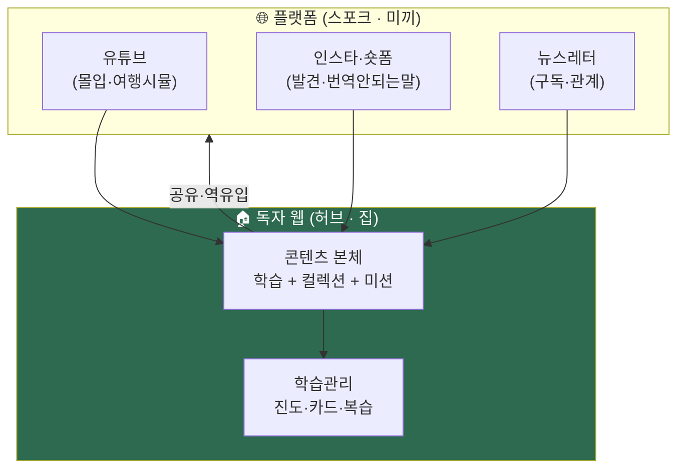
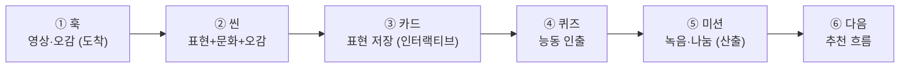
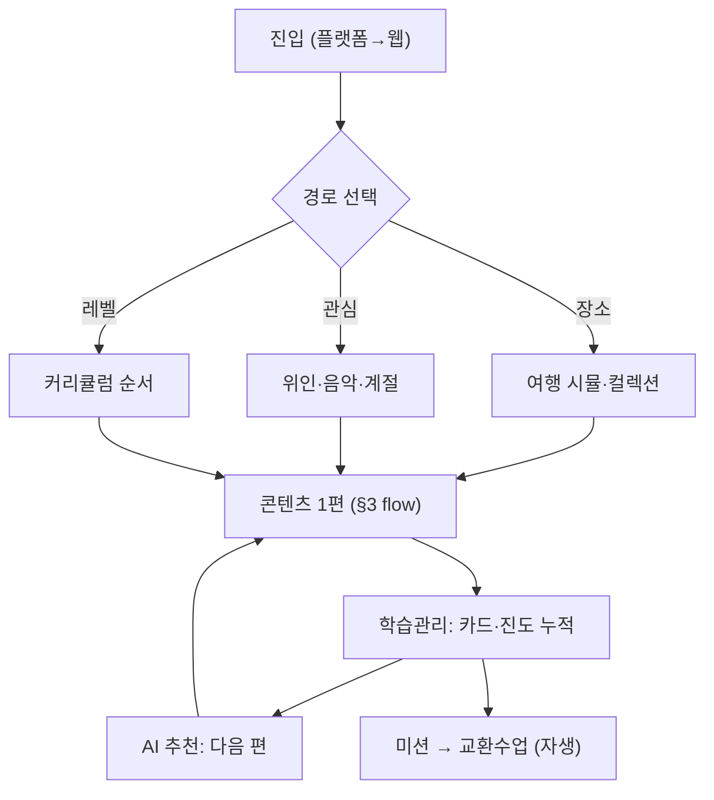

> [!quote] 한 문장
> **독자 웹 = 집(本), 플랫폼(유튜브·인스타·뉴스레터) = 길(미끼).**
> 길에서 발견 → 집으로 데려와 몰입·학습·관계. 콘텐츠 원본은 **Markdown**, 웹은 정적 사이트로 자동 생성.

> 남의 플랫폼에만 의존 = 셋방(알고리즘·삭제 리스크). **독자 웹 = 내 자산**([[인생도형]] 밀도·비휘발).

---

## 1. 전체 구조 — 허브 & 스포크



→ **플랫폼은 데려오고, 웹은 붙잡는다.** 발견은 남의 땅, 학습·관계·데이터는 내 땅.

---

## 2. 기술 스택 — Markdown 원본 + 정적 사이트

> 핵심 결정: **콘텐츠는 Markdown, 사이트는 정적 생성(SSG).** HTML 직접 작성 X.

| 층 | 선택 | 이유 |
|:-:|------|------|
| **콘텐츠 원본** | **Markdown** (+ frontmatter) | 채연 Obsidian 그대로 / AI 생성·편집 쉬움 / 버전관리 |
| **사이트 생성** | **Astro** (또는 Next.js) | MD → 빠른 정적 HTML, 인터랙션 섬(Islands) |
| **인터랙션** | 경량 JS (퀴즈·카드·오디오) | 필요한 곳만 (인생도형.html처럼) |
| **호스팅** | Cloudflare/Vercel/Netlify | 무료·빠름·자동배포 |
| **데이터** (진도) | Supabase/로컬 | 학습관리 (로그인 후) |
| **검색·임베드** | 유튜브 임베드·태그 | 영상 §5 모델 |

→ **왜 Astro/SSG**: Markdown 콘텐츠 → 자동 HTML, 인터랙션은 "섬"으로 부분 주입. 채연이 *글만 쓰면* 사이트가 됨. (Obsidian → 발행 파이프라인 자연스러움)

### Markdown vs HTML 결정

| | Markdown | HTML 직접 |
|---|:-:|:-:|
| 작성·AI 생성 | ★★★★★ | ★★ |
| 버전관리·재사용 | ★★★★★ | ★★ |
| 인터랙션 | △ (섬 주입) | ★★★★★ |
| **결론** | **본문 = MD** | **인터랙션만 컴포넌트** |

→ **MD가 원본, 인터랙티브 요소(퀴즈·카드·오디오 플레이어)만 컴포넌트로 삽입.** 99% MD + 1% JS.

---

## 3. ★ 콘텐츠 1개의 Flow (한 편 내부)

> 한 콘텐츠 = [[야네센]] 5블록을 *웹 인터랙션*으로.



| 블록 | 형식 | 인터랙션 |
|:-:|------|----------|
| ① 훅 | 임베드 영상 + 오감 글 | 자동재생 클립 |
| ② 씬 | MD + 표현 표 | 표현 클릭 → 발음 오디오 |
| ③ 카드 | 표현 저장 | "내 단어장에 추가" 버튼 |
| ④ 퀴즈 | 4지선다·빈칸 | 즉시 채점 (경량 JS) |
| ⑤ 미션 | 녹음·텍스트 | 업로드 → AI/파트너 |
| ⑥ 다음 | 추천 | "관련 컬렉션·다음 편" |

→ **수동 읽기 X → 보고·듣고·저장·풀고·산출.** 4원리(몰입·산출·맥락·감각) 통과.

---

## 4. ★ 학습 전체 Flow (콘텐츠 간 연결)

> 한 편을 넘어 *전체 여정*. 어떻게 다음으로 이어지나.



### 3가지 진입 경로 (학습자 선택)

| 경로 | 누구 | 예 |
|:-:|------|-----|
| **장소** | 여행·덕질 | "도쿄" → 야네센·신주쿠 컬렉션 |
| **관심** | 음악·인물 팬 | "사카모토" → 위인 산책 |
| **레벨** | 체계 원함 | N5→N4 커리큘럼 순서 |

→ **비선형 + 선형 공존.** 덕질로 들어와도, 뒤에선 레벨·진도가 받쳐줌.

### 이어짐 메커니즘

| 장치 | 작동 |
|:-:|------|
| **AI 추천** | 본 것·약점 → 다음 편 제안 |
| **컬렉션 진척** | "야네센 3/5편" 수집 동기 |
| **카드 누적** | 배운 표현이 단어장에 쌓임 → 복습 |
| **미션 체인** | 산출 → 교환수업 → 다음 학습 |

---

## 5. 콘텐츠 형식(제공 방식) 윤곽

| 형식 | 매체 | 인터랙션 |
|:-:|------|----------|
| **여행 시뮬** | 웹 MD + 임베드 영상 | 씬 진행·미션 |
| **장소 컬렉션** | 웹 MD 묶음 | 작품·문학 탭 |
| **표현 카드** | 컴포넌트 | 저장·복습·오디오 |
| **퀴즈** | 경량 JS | 즉시 채점 |
| **오디오** | 발음·섀도잉 | 재생·녹음 |
| **위인·음악·계절** | 웹 MD | 컬렉션 연결 |

→ 전부 **MD 본문 + 필요한 곳 컴포넌트.** 일관된 틀.

---

## 6. 빌드·운영 Flow (AI 파이프라인)

```
Obsidian/MD 작성 (채연 + AI)
  → git push
  → SSG 자동 빌드 (Astro)
  → 정적 사이트 배포 (Cloudflare)
  → 플랫폼 분사 (숏폼·레터 자동)
```

→ [[AI역할분리]]: **MD 생성·빌드·배포·분사 = AI/자동 / 콘텐츠 큐레이션·감수 = 채연.** 채연은 *글만* 쓰면 사이트+플랫폼 동시.

---

## 7. 단계별 구축 (현실)

| Phase | 구축 | 산출 |
|:-:|------|------|
| **0 MVP** | Astro + MD 5편 + 임베드 (인터랙션 0) | 정적 학습 사이트 |
| **1** | 표현 카드·퀴즈 컴포넌트 | 인터랙티브 |
| **2** | 로그인·진도·단어장 (Supabase) | 학습관리 |
| **3** | AI 추천·미션·교환수업 연동 | 자생 플랫폼 |

→ **MVP = Astro로 MD 5편 정적 사이트.** 코드 최소, 채연 가능 범위. 인생도형.html 만든 수준이면 충분.

---

## 8. 윤곽 한눈

```
원본:    Markdown (Obsidian)
빌드:    Astro SSG → 정적 HTML
인터랙션: 경량 JS 섬 (카드·퀴즈·오디오)
호스팅:  Cloudflare (무료·빠름)
허브:    독자 웹 (학습·관계·데이터 = 내 자산)
스포크:  유튜브·숏폼·뉴스레터 (발견·미끼)
콘텐츠flow: 훅→씬→카드→퀴즈→미션→다음
학습flow:  진입(3경로)→학습→누적→추천→자생
분업:    MD·빌드·분사 = AI / 큐레이션·감수 = 채연
```

---

## 9. 메타 위치

| 출처 | 관계 |
|------|------|
| [[언어문화몰입-구상]] | 무엇(카테고리) — 본 페이지는 어떻게(웹·형식·flow) |
| [[야네센]] | 콘텐츠 1편 = §3 flow 실물 |
| [[AI역할분리]] | MD·빌드·분사 AI / 큐레이션 채연 |
| [[인생도형]] | 독자 웹 = 비휘발 자산(밀도) / 플랫폼 = 부피(도달) |

→ **독자 웹(허브·MD·정적) + 플랫폼(스포크·미끼).** 콘텐츠는 5블록 flow, 여정은 3경로→누적→자생. 채연은 글만 쓰고 AI가 사이트·분사.
