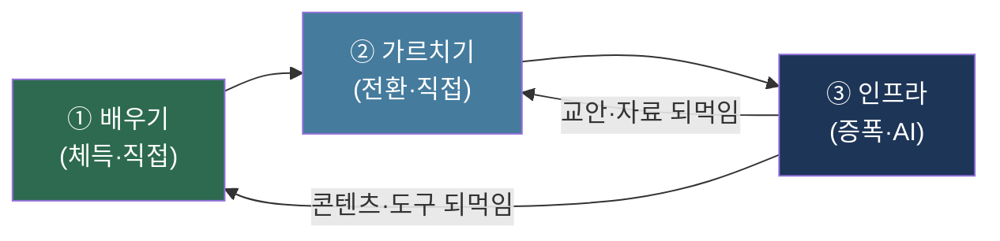
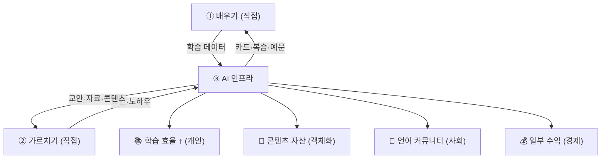

> [!quote] 한 문장
> **① 내가 언어를 배우고 → ② 가르치며 → ③ 그 인프라(콘텐츠·학습관리)를 AI로 자동화.**
> 언어 = 체득(직접) → 가르침(직접) → 증폭(AI). 한 활동이 학습·직업·커뮤니티·수익을 동시에 낳는다.

> [[AI역할분리]]의 일반 원리를 **언어**라는 단일 축으로 구체화한 실행안.

---

## 1. 세 역할 — 한 흐름

| 역할 | 담당 | 자본 | 인생도형 | 양도 |
|:-:|:-:|------|:-:|:-:|
| ① 배우기 | **나** | 체화 문화 | y 몰입·x 머무름 | ❌ |
| ② 가르치기 | **나** | 사회·상징 | z 확장 (관계) | ❌ |
| ③ 인프라 | **AI** | 객체화·경제 | z 확장 (시간·의미) | ✅ |

→ **①②는 직접(부피 축적·전환), ③은 AI(부피 증폭).** 배움이 가르침의 재료가 되고, 가르침이 인프라의 콘텐츠가 되고, 인프라가 다시 배움·가르침을 돕는 순환.

---

## 2. ① 배우기 (체득 · 직접)

> 양도 불가. AI는 *보조 도구*만, 체득은 나.

| 항목 | 내용 | AI 보조 한계선 |
|------|------|------|
| 대상 언어 | 한(C2)·일(N1)·영(C1목표)·중·독·프 | — |
| 깊이 우선 | 만 30 마감 4개국 B2+ → 영어 집중 (인생도형 §9 충만체) | AI는 복습·문제 생성만 |
| 방법 | Anki 12필드·원서 독서·섀도잉·언어교환 | AI는 카드·예문 생성, 암기는 직접 |
| 기록 | 학습 로그·오답·표현 수집 | **③ 인프라로 자동 수집** |

> 핵심: **배움 자체가 ③의 1차 데이터**. 내가 배우는 모든 것이 콘텐츠 원천.

---

## 3. ② 가르치기 (전환 · 직접)

> 체화 자본 → 사회·상징·경제 자본 전환. 부르디외 §5 전환의 핵심 행위.

| 형태                          | 시점        | 자본 전환           |  수익성  |
| --------------------------- | --------- | --------------- | :---: |
| **1대1 과외** (영·일·중)          | 한국·이동기 즉시 | 체화 → 경제         |  ★★★  |
| **한국어 교환수업** ([[한국어교환수업-구상]]) | 현재~ | 체화 → 사회 (비상업) | — |
| **언어교환·소그룹 운영**             | 현재~       | 체화 → 사회         |   ★   |
| **온라인 튜터링** (Italki·Preply) | 이동기       | 체화 → 경제 (장소 무관) |  ★★★  |
| **콘텐츠 강의** (학습법·다국어)        | 정착기       | 체화 → 객체화 → 경제   | ★★★★  |
| **정규 교사** (NSW 등, 선택)       | 만 33~     | 제도화 → 경제·상징     | ★★★★★ |

> 가르침 = **배움을 검증·정리하는 행위** (가르치며 가장 깊이 배운다) → ①을 강화.
> "잘하고 싶은 것 살려서 도와주기" (자기명시 §3.2) = ①×② 직접 실현.

---

## 4. ③ 인프라 (증폭 · AI 자동화)

> 양도 가능. 1회 구축 → 자동 운영. 두 갈래: **개인 학습관리** + **콘텐츠·커뮤니티**.

### 4.1 개인용 학습 관리 (내 ①을 돕는 시스템)

| 모듈       | 자동화                                | 도구            |
| -------- | ---------------------------------- | ------------- |
| 카드 생성    | 원서·기사 → Anki 12필드 카드 자동 (어원·예문·연어) | Claude API    |
| 오답·약점 추적 | 학습 로그 → 약점 리포트·복습 우선순위             | Python + DB   |
| 예문·문제 생성 | 목표 표현 → 맥락 예문·퀴즈 자동                | LLM           |
| 독서 보조    | 원서 난이도·핵심 어휘 사전 추출                 | LLM           |
| 진도 대시보드  | 언어별 시간·레벨 추이 시각화                   | 기존 Phase 2 확장 |

### 4.2 콘텐츠·커뮤니티 (내 ①②를 증폭하는 시스템)

| 모듈        | 자동화                    | 산출      |
| --------- | ---------------------- | ------- |
| 학습 콘텐츠 생성 | 내 학습 부산물 → 블로그·뉴스레터 초안 | 콘텐츠 자산  |
| 다국어 변환    | 한 글 → 4~6개국어 자동 번역     | 다국어 도달  |
| 발행·배포     | 블로그·SNS·뉴스레터 크로스포스팅    | 자동 발행   |
| 교안 생성     | 수업 주제 → 교안·자료 초안       | ②가르침 지원 |
| 커뮤니티 봇    | 언어교환 매칭·자료 안내·FAQ      | 커뮤니티 운영 |
| 학습자 관리    | 수강생 진도·피드백 자동 (튜터링 시)  | 수익 운영   |

> ⚠️ **AI 한계선**: 카드·초안·번역·매칭·운영은 AI / **최종 목소리·실제 가르침·깊은 관계는 직접** (AI역할분리 §8).

---

## 5. 순환 구조 — 한 활동, 네 결실

| 결실 | 자본 | 비고 |
|------|------|------|
| 학습 효율 ↑ | 체화 강화 | ①로 되먹임 |
| 콘텐츠 자산 | 객체화 | 자서전·블로그·강의 |
| 언어 커뮤니티 | 사회 | 환대 공동체 시드 |
| 일부 수익 | 경제 | 튜터링·멤버십·강의 (지탱 수단) |

→ **언어 학습 하나가 학습·직업·커뮤니티·수익을 동시에 낳음** — 인생도형 충만체(§9) + 부르디외 전환(§5)의 실물.

---

## 6. 구축 단계 (언어 축)

| Phase | 시점 | ① 배우기 | ② 가르치기 | ③ AI 인프라 |
|:-:|------|---------|-----------|-------------|
| **0** | 현재~한국 | 영·프 집중 + Anki | 1대1 과외·언어교환 | 개인 학습관리 자동화 (카드·로그) |
| **1** | 이동·워홀기 | 다국어 환경 체득 | 온라인 튜터링 | 콘텐츠 생성·발행 자동화 |
| **2** | 정착 초기 | 영어 C2·자격 | 정규/사설 교사 + 강의 | 다국어 콘텐츠·유료 멤버십 |
| **3** | 만년 | 언어 유지·심화 | 환대 공동체 교육 | 커뮤니티 봇·학습 플랫폼 |

> 각 단계 = **①②는 점진 심화, ③은 1회 구축 후 자동 운영**.

---

## 7. 정합 요약

| 프레임 | 이 구상에서 |
|------|------|
| 자기명시 §3.2 | "잘하고 싶은 것(①배움) 살려 도와주기(②가르침)" 직접 실현 |
| 인생도형 §9 | 언어 = 충만체 (배움 y·x + 가르침·인프라 z) |
| 부르디외 §5 | ① 체화 축적 → ② 사회·상징 전환 → ③ 객체화·경제 증폭 |
| AI역할분리 | ①② 직접 / ③ AI — 양도 가능성 분업의 언어판 |
| MBTI §8·§9 | ③ AI가 Ti(시스템) 담당 → 내 소모 차단, ①② 집중 |

---

## 8. 메타 위치

| 출처 | 관계 |
|------|------|
| [[AI역할분리]] | 일반 원리 — 본 페이지가 언어 축 구체화 |
| [[자본분류-부르디외]] §2.2·§5 | 문화자본 3상태 + 전환 |
| [[인생도형]] §9 | 언어 학습의 도형 (충만체) |
| [[원채연/직업정체성]] §9 | Teaching 본업 = ② 가르치기 |
| [[원채연/자기명시]] §3.2 | 직업 본질 정의 |

→ **언어 프로젝트 = ①배움(직접)·②가르침(직접)·③인프라(AI)의 순환.** 한 축(언어)이 자기 성장·직업·커뮤니티·수익을 동시에 낳는 채연의 핵심 실행안.
