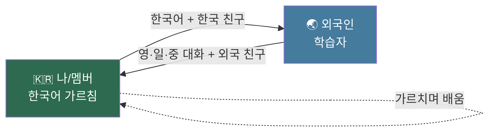
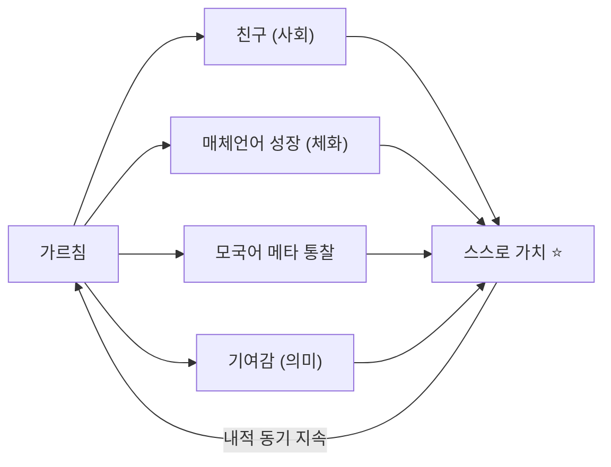

> [!quote] 한 문장
> **외국인에게 한국어를 (영·일·중으로) 가르치되 — 비상업 언어교환 형식 + 커리큘럼 기반.**
> 가르치는 사람의 동기 = *친구 사귀기* 또는 *자기 언어 늘리기*. **가르치며 배우고, 스스로 가치를 느끼는 것이 핵심.**

---

## 1. 모델 정의

| 이다 (O) | 아니다 (X) |
|----------|-----------|
| 비상업 **언어교환** (서로 가르침) | 유료 과외·학원 |
| **커리큘럼·자료 기반** (구조) | 즉흥 수다·무계획 |
| 가르치며 **자기 언어(영·일·중)도 성장** | 일방적 봉사·소진 |
| 친구·관계 형성 (사회 자본) | 실적·수익 (경제 자본) |
| **최소 기준** 있는 교환 | 질 없는 만남 |

→ "그냥 언어교환"과 다른 점 = **커리큘럼 + 최소 기준**. "유료 수업"과 다른 점 = **비상업 + 상호 학습**.

---

## 2. 핵심 메커니즘 — 왜 지속되나



**이중 동기 (지속의 비밀)** — 비상업인데도 가르치는 사람이 얻는 것:

| 동기 | 얻는 것 | 자본 |
|------|--------|------|
| 친구 사귀기 | 외국인 친구·트랜스내셔널 관계 | 사회 |
| 언어 늘리기 | 매체 언어(영·일·중) 실전 + 모국어 메타 통찰 | 체화 문화 |
| 기여감 | "도움이 됐다" → 스스로 가치 | 상징·의미 |

→ **돈이 아니라 친구·언어·의미가 보상** → 내적 동기로 지속 (비상업 가능 이유).

---

## 3. 매체 언어별 대상

| 매체 | 대상 | 채연 효과 |
|:-:|------|----------|
| 🇬🇧 영어 | 영어권·국제 학습자 | 영어 C1→C2 실전 (만 30 후 집중) |
| 🇯🇵 일본어 | 일본 학습자 | N1 유지·심화 |
| 🇨🇳 중국어 | 중화권 학습자 | 중국어 B2 실전 |

→ **한국어를 가르치는 매체가 곧 내 학습 대상**. 한 세션이 ①배움 + ②가르침 동시 (언어프로젝트 §1).

---

## 4. 커리큘럼 구조 (한국어 학습자용)

| 레벨 | 내용 | 매체 자료 |
|:-:|------|----------|
| **L0** | 한글·발음·기본 인사 | 영·일·중 발음 대조 |
| **L1** | 생존 회화 (자기소개·주문·길) | 상황별 표현집 |
| **L2** | 일상 대화 (취미·일·관계) | 주제별 어휘·문형 |
| **L3** | 문화·뉘앙스·관용·존댓말 | 문화 노트 |

→ 각 레벨 = 매 세션 **1꼭지**씩. 사전 준비된 자료(§5)로 진행.

---

## 5. 자료 (③ AI 인프라가 생성)

> 커리큘럼·자료는 [[AI역할분리]] ③ 모듈로 자동 생성. 1회 구축 → 반복 사용.

| 자료 | AI 자동 생성 |
|------|------------|
| 레벨별 교안·슬라이드 | 주제 → 한국어 + 영·일·중 설명 |
| 단어장 | 한국어 ↔ 3개 언어 (예문·발음) |
| 세션 템플릿 | 진행 순서·시간 배분 |
| 학습자 진도 시트 | 레벨·출석·피드백 기록 |
| 복습 자료 | 세션 후 요약·과제 자동 |

→ 자료 = **객체화 문화자본** (재사용·확장). 멤버에게 공유 → 누구나 가르칠 수 있음 (확장성).

---

## 6. 세션 형식

| 항목 | 기본 |
|------|------|
| 형태 | 1:1 또는 소그룹 (2~4) |
| 시간 | 60~90분 |
| 구성 | **한국어 학습 절반 ↔ 매체언어 자유대화 절반** (교환 비율) |
| 흐름 | 커리큘럼 1꼭지 → 연습 → 자유 대화 → 다음 예고 |
| 채널 | 온라인(글로벌) + 오프라인(부산·이동지·정착지) |

---

## 7. "최소 기준" — 가르치는 자의 기준선

> 무료라도 질을 가르는 선. 이게 "수다"와 "교환수업"을 나눈다.

- [ ] 매 세션 **커리큘럼 1꼭지** 진행 (무계획 X)
- [ ] **자료 사전 준비** (AI 베이스 + 5분 검토)
- [ ] **교환 비율 지킴** (한쪽만 득 X)
- [ ] 학습자 산출 **피드백 1회** (교정)
- [ ] **기록** → 다음 세션 연결 (일회성 X)

→ 최소 기준만 지키면 *부담 적고 질 보장*. 완벽주의(INFJ-T) 차단 — "최소"가 핵심.

---

## 8. ★ 스스로 가치 느끼기 (핵심 설계)

> 비상업 = 돈 동기 없음 → **내적 동기로만 지속**. 가르치는 자가 가치를 직접 느껴야 함.



| 가치 | 어떻게 느끼나 |
|------|-------------|
| 친구 | 외국인과 깊은 관계 형성 |
| 언어 | 영·일·중을 *실전에서* 씀 |
| 통찰 | 한국어를 외부 시선으로 재발견 (가르치며 배움) |
| 기여 | "내 도움으로 누가 한국어를 함" → 의미 |

→ **인생도형 충만체**: 가르침이 부담(막대)이 아니라 *몰입+관계+기여*(충만체)가 되도록 설계. 가치를 못 느끼면 모델 실패.

---

## 9. 비상업 원칙 + 환대 공동체 연결

| 원칙 | 내용 |
|------|------|
| 무료 | 돈 받지 않음 — 보상은 관계·언어·의미 |
| **Pay-it-forward** | 배운 학습자가 다음 학습자에게 (또는 자기 모국어로) 가르침 — 자기명시-2 §2.3 Step 4 |
| 확장 | 자료(§5) 공유 → 멤버 누구나 가르침 → 자가 증식 |
| 시드 | **트랜스내셔널 환대 공동체의 언어 모듈** — 한국·워홀지·정착지 어디서나 복제 |

→ 이 모델 = 환대 공동체(자기명시-2)의 **가장 구체적이고 즉시 실행 가능한 첫 형태**. 부산에서 지금 시작 가능.

---

## 10. 자본·정합

| 프레임 | 이 모델에서 |
|------|------|
| 부르디외 | 체화(한국어·영일중) → 사회(친구) + 상징(기여) 전환, **비상업이라 경제 전환은 의도적 배제** |
| 인생도형 | 가르침 = z(확장·관계) + 자기 배움 = y·x → 충만체 |
| 언어프로젝트 §3 | ② 가르치기의 비상업 버전 (유료 튜터링과 병행 가능) |
| AI역할분리 | 커리큘럼·자료·진도 = ③ AI / 가르침·관계 = 직접 |
| 자기명시 §3.2 | "잘하고 싶은 것 살려 도와주기" 직접 실현 |
| MBTI §9 | Fe(환대)를 *최소 기준*으로 구조화 → 과사용·소진 방지 |

---

## 11. 즉시 실행 (Phase 0 — 한국)

| 단계 | 할 일 |
|:-:|------|
| 1 | L0~L1 커리큘럼·자료 AI로 1차 생성 (영·일·중) |
| 2 | 부산 언어교환 모임·앱(HelloTalk·Tandem)에서 1~2명 시작 |
| 3 | 최소 기준(§7) 적용 + 세션 기록 |
| 4 | 자료·진행 다듬기 → 템플릿화 |
| 5 | 이동기(워홀)·정착지에서 동일 모델 복제 |

→ **돈·자격 없이 지금 시작 가능**. 환대 공동체의 첫 벽돌.

---

## 12. ★ 양방향 매칭 플랫폼 (확장 — 수익화 3차)

> 1:1 교환을 넘어 **학습자끼리 잇기.** 한국인 일본어 학습자 ⇄ 일본인 한국어 학습자 = *서로가 서로의 교사*. [[언어수익화-구상]] 3차 = 이 페이지의 확장.

### 12.1 양방향 = 같은 맥락

```
나(채연) → 외국인에 한국어 (이 페이지 1~11)
        ↓ 확장
학습자 ⇄ 학습자 (내가 매개·매칭)
한국인(일본어 학습) ⇄ 일본인(한국어 학습)
        = 서로의 모국어를 서로 가르침
```

→ 채연 = *교사*에서 *매개자(허브)*로. 1:1 가르침의 *N:N 자생*.

### 12.2 왜 채연만 가능 (블루오션)

| 일반 언어교환 앱 | 채연 매칭 |
|----------------|----------|
| 무작위 매칭·방치 | **커리큘럼 + 최소 기준** (§4·§7) |
| 질 없음 | 교학상장 구조 + 문화 콘텐츠 |
| 단순 채팅 | 場·환대 (관계 깊이) |
| 일방향 | **한일 양방향** (둘 다 학습자·교사) |

→ 차별 = *방법론(커리큘럼) + 문화 콘텐츠(언어문화몰입) + 場(관계)*. 앱이 못 하는 *질·깊이·구조*.

### 12.3 수익 모델 (비상업 원칙 안에서)

| 무료 | 유료·후원 |
|------|----------|
| 매칭·기본 교환 | **프리미엄 매칭** (레벨·목적·문화 기반) |
| 커리큘럼 L0~L1 | 심화 커리큘럼·문화 콘텐츠 |
| 커뮤니티 참여 | 운영 후원·멤버십 |

→ ⚠️ 비상업 정신(§9) 유지: *매칭·관계는 무료, 편의·심화·운영*에 후원. 돈 = 플랫폼 지탱 수단.

### 12.4 자생 메커니즘

| 장치 | 작동 |
|:-:|------|
| Pay-it-forward (§9) | 배운 자 → 다음 학습자 교사 |
| 콘텐츠 공유 | 자료(§5) = 누구나 가르침 |
| 매칭 봇 ([[AI역할분리]]) | 레벨·시간대·목적 자동 |
| 문화 콘텐츠 연동 | [[언어문화몰입-구상]] = 교환 소재 |

→ **N:N 자생** = 채연 없이 굴러감 (밀도 ★★★★★). [[소울맵-구상]] 관계망과도 결합 가능.

### 12.5 단계 (1차 검증 후)

| 시점 | 단계 |
|:-:|------|
| 한국 몰입 | 1:1 교환 (§11) — 방법론 검증 |
| 이주·이후 | 소규모 매칭 (한일 학습자 몇 쌍) |
| 정착 후 | 플랫폼·자생 (웹·봇) |

→ **1:1(지금) → 매칭(검증 후) → 플랫폼(정착 후).** 한국어교환수업이 곧 3차의 씨앗.

---

## 12. 메타 위치

| 출처 | 관계 |
|------|------|
| [[언어프로젝트-구상]] §3 | ② 가르치기의 비상업·교환 버전 |
| [[AI역할분리]] §4 | 커리큘럼·자료·진도 = AI 인프라 |
| [[원채연/자기명시]] §2 환대 공동체 | 언어 모듈 = 공동체 첫 형태 (Pay-it-forward) |
| [[인생도형]] §9 | 가르침이 충만체가 되는 설계 |
| [[자본분류-부르디외]] §5 | 체화 → 사회·상징 전환 (경제 의도 배제) |

→ **한국어 교환수업 = 비상업·커리큘럼·교학상장 모델.** 가르치며 배우고, 친구를 얻고, 스스로 가치를 느끼는 — 환대 공동체의 즉시 실행 가능한 첫 벽돌.
