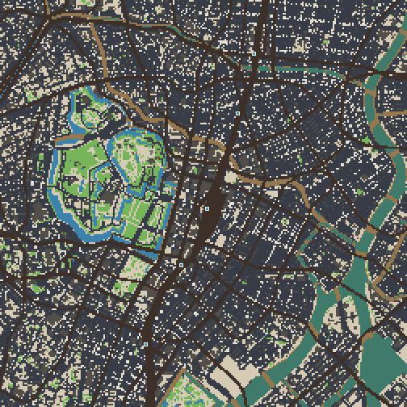
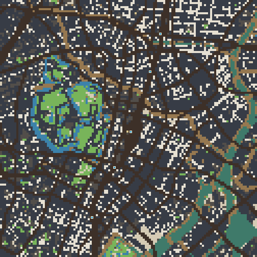
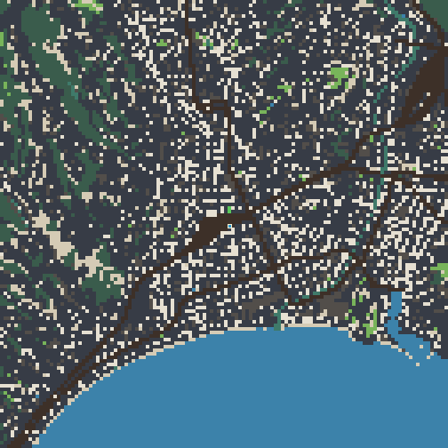
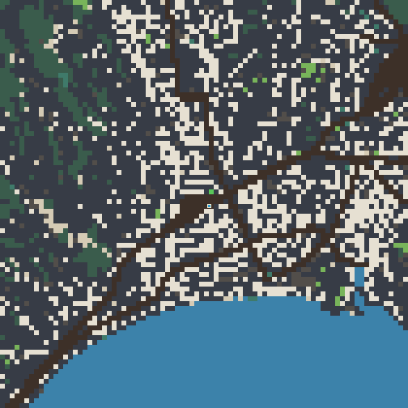

# 도시 미니맵 factor 복귀안 A/B 시각 자료

- 상태: **report-only** — 제품 코드·geo·registry·verifier·DB 변경 없음
- 기준: `origin/main` `32e2b4d55cfd9c6f76071b7487e633e66d15aa7d`
- 발주: 이슈 #150 코멘트 `5046785647` T1
- 선행 감사: `docs/audit-tokyo-memory.md`
- 측정일: 2026-07-22

## 판정

1. **도쿄 factor 1→2는 승인 권고**다. 같은 252×252타일 크롭에서 지형 경계 전환이
   47,466→25,638(-46.0%)로 줄지만, 황궁 수계·공원 윤곽·간선도로·철도망과 5개 역 표시는
   분리되어 남는다. 최종 canvas backing은 30.723→7.681 MiB(-75.0%)다.
2. **코트다쥐르 factor 2→3도 승인 권고**다. 경계 전환은 22,358→14,136(-36.8%)로 줄고
   세도로가 더 굵게 합쳐지지만, 니스 해안선·바르강 수계·도심 간선·TER 축과 Nice-Ville 표시는
   판독 가능하다. backing은 15.786→7.016 MiB(-55.6%)다.
3. 두 제안 모두 크롭 안의 지형 종류와 역 수를 보존한다. 선행 감사의 런타임 하한도 각각
   40.964→13.228 MiB, 27.177→15.971 MiB로 내려가 24 MiB 계약에 복귀한다.
4. 이 자료는 factor의 지형 손실만 결정적으로 비교한다. OS 글꼴에 따라 PNG hash가 달라지는
   구역 라벨은 제외했으므로, 구현 라운드에서는 실제 240 CSS px 미니맵에서 라벨 겹침을 한 번 더
   확인해야 한다.

## 동일 지리 범위 A/B

두 도시는 모두 실제 world tile 252×252를 2px/타일로 그린 **504×504 PNG**다. 도쿄는
`left=354, top=198`(도쿄역 중심권), 코트다쥐르는 `left=684, top=126`(Nice-Ville 중심권)을
고정했다. 따라서 A/B 사이에 보이는 블록 크기 차이는 crop·resize 차이가 아니라 factor 차이다.

### 도쿄 — 현재 factor 1

### 도쿄 — 제안 factor 2

### 코트다쥐르 — 현재 factor 2

### 코트다쥐르 — 제안 factor 3

## 전체 미니맵 pixel dimension

`source`는 지형을 굽는 offscreen 크기, `display`는 `CITY_MINI_SCALE=3`을 적용한 최종 canvas
backing 크기다. PNG는 비교용 고정 크롭이므로 이 표의 전체 backing 크기와 다르다.

| 도시 | 상태 | factor | source px | source pixels | display/backing px | RGBA backing |
|---|---|---:|---:|---:|---:|---:|
| 도쿄 | 현재 | 1 | 824×1086 | 894,864 | 2472×3258 | 32,215,104 bytes (30.723 MiB) |
| 도쿄 | 제안 | 2 | 412×543 | 223,716 | 1236×1629 | 8,053,776 bytes (7.681 MiB) |
| 코트다쥐르 | 현재 | 2 | 786×585 | 459,810 | 2358×1755 | 16,553,160 bytes (15.786 MiB) |
| 코트다쥐르 | 제안 | 3 | 524×390 | 204,360 | 1572×1170 | 7,356,960 bytes (7.016 MiB) |

## 크롭 정량 비교

`visible sample cells`는 252×252타일을 구성하는 factor 적용 후 source cell 수다.
`terrain transitions`는 크롭을 world-tile 간격으로 다시 읽어 가로·세로 인접값이 달라지는 횟수다.
철도는 실제 미니맵처럼 factor cell 안에 한 칸이라도 있으면 그 source cell을 철도색으로 칠했다.

| 도시 | 상태 | visible sample cells | terrain transitions | 지형 코드 종류 | 철도 source cells | 역 |
|---|---|---:|---:|---:|---:|---:|
| 도쿄 | 현재 | 63,504 | 47,466 | 9 | 8,686 | 5 |
| 도쿄 | 제안 | 15,876 | 25,638 | 9 | 3,398 | 5 |
| 코트다쥐르 | 현재 | 15,876 | 22,358 | 9 | 857 | 1 |
| 코트다쥐르 | 제안 | 7,056 | 14,136 | 9 | 534 | 1 |

- 도쿄 factor 2에서 흰 보도 조각과 건물 사이 골목이 2타일 블록으로 합쳐지지만, 황궁 주변의
  수계·녹지 경계와 굵은 도로·철도 위계는 유지된다.
- 코트다쥐르 factor 3에서는 니스 구시가의 작은 보도 조각이 더 크게 합쳐진다. 반면 해안과 바르강,
  Nice-Ville을 지나는 TER, 남북·동서 간선은 끊기지 않는다.
- 두 크롭 모두 factor 적용 전후 `visibleTerrainCodes` 집합이 exact 동일하다. 세부량은 줄지만
  크롭을 구성하는 지형 범주 자체가 사라지지는 않는다.

## 렌더 계약과 한계

`scripts/world/render-minimap-factor-ab.mjs`는 제품 코드를 바꾸지 않고 다음 계약을 읽는다.

1. 각 도시의 정본 `buildGrid()`·`railways.mask`·`stations`를 사용한다.
2. 제품의 `downsampleCityGrid()`를 그대로 호출해 도로·출구 등 `TILE_PRIORITY`를 보존한다.
3. `GameCanvas.jsx`의 도시 미니맵 RGB 팔레트, 철도색, 역의 크림 테두리·청록 중심을 복제한다.
4. A/B 모두 같은 지리 범위와 같은 504×504 출력으로 고정하고 nearest-neighbor 방식으로 그린다.
5. 플레이어·차량처럼 시점마다 변하는 overlay와 OS 글꼴 기반 구역 라벨은 제외한다.

이 비교는 factor 승인용 정적 자료이지 구현 승인 자체가 아니다. factor 선택식·24 MiB hard gate·
라벨 처리의 제품 반영은 별도 SPEC에서 다룬다.

## 결정성·파일 크기

독립 출력 경로 두 곳에서 직렬로 재생성했고 네 PNG 모두 byte-identical이었다.

| PNG | bytes | run A SHA-256 | run B |
|---|---:|---|---|
| `minimap-factor-ab-tokyo-current.png` | 26,576 | `df7e5c39b3767be1ac408012a2cb38b1870bfb8e7aa8bf9eb070535eeb06cae0` | identical |
| `minimap-factor-ab-tokyo-proposed.png` | 11,483 | `8bb5a520f8eb6d50b59ac6e234c864128c1bc00d543fe660aef8bd2e2483b2a2` | identical |
| `minimap-factor-ab-cote-dazur-current.png` | 9,714 | `9c317a78fd0d16d6b801bddc68aad9528aec65e5414bf2bb741863e05d257bcc` | identical |
| `minimap-factor-ab-cote-dazur-proposed.png` | 6,360 | `e186bb9da90dd75a8d3fa87d462a61ff6c8d7d8d5b48c4ed0f80301f9181e0bd` | identical |

총 PNG 크기는 54,133 bytes(52.9 KiB)이며, 모든 변이의 각 축은 504px로 512px 제한 이하다.

## 검증 근거

- Node `v22.23.1`
- PNG 독립 2회 생성: 4/4 byte-identical SHA-256
- PNG 육안 확인: 4/4 정상(504×504, RGB, non-interlaced)
- targeted: 4 files / 31 tests PASS; max RSS 2,759,409,664 bytes;
  peak footprint 48,208,616 bytes / swaps 0
- full single-worker: 199 files / 2,059 tests PASS; max RSS 2,331,836,416 bytes;
  peak footprint 48,421,536 bytes / swaps 0
- `npm run lint`·`git diff --check`: PASS
- 제품 구현·geo 재생성·공유 runtime·registry·verifier·DB 변경 없음
