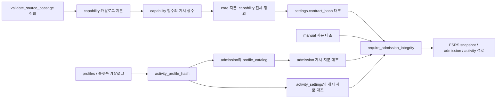

# LEARN-CONTRACT-CATALOG-001 — 운영 학습 계약 의존 지도

출처: [M00 배정 6093632776](https://github.com/wonchance-art/manabi/issues/1337#issuecomment-6093632776), 2026-10-10 운영 PostgreSQL **17.6** 카탈로그 READ ONLY 추출. 기준 main `6585905a66581c2aea3e54f7eee25d31530ca4bd`. 운영 변경·학습 행 조회 없음. 설정에서 읽은 값은 공유 게시 지문뿐이다. #1393/r2 적용·Preview·병합은 보류 상태다.

## 산출물과 실행

- [관측 계약 SQL](../../supabase/tests/fixtures/m09-learning-contracts-20261010.sql): 함수 73개, 테이블 24개·뷰 3개, 제약 100개, 인덱스 46개, 정책 32개, 사용자 트리거 26개, DDL event trigger 6개. 함수 본문·속성·owner·ACL, 컬럼·제약·인덱스·RLS·정책·트리거·뷰 정의는 관측값이다.
- [로컬 검증 스크립트](../../supabase/tests/learning-contract-catalog.mjs): 기존 10-03 `modernFixtureSql` → `korean-learning-support.sql` → 새 fixture 순으로 **매번 새 PGlite**에 설치한다. DB URL·Supabase 클라이언트·운영 연결을 사용하지 않는다.

```sh
# 저장소 루트, Node 24 / npm ci 완료 후
node supabase/tests/learning-contract-catalog.mjs

# 선택: exact 후보 SQL 두 파일을 로컬 PGlite에만 추가 실행
node supabase/tests/learning-contract-catalog.mjs /absolute/apply.sql /absolute/rollback.sql
```

SQL은 PGlite 버전 및 모든 대상 테이블의 빈 상태를 확인한 뒤 빈 기존 fixture 관계만 재구성한다. `auth.users`에 행이 있거나 대상 테이블에 행이 있으면 DDL 전에 실패한다. 재실행용 migration이 아니며 운영에 적용하지 않는다. `check_function_bodies=off`는 원본의 전방 참조·플랫폼 참조 정의를 설치하기 위한 로컬 DDL 옵션이다. 계약 지문 쿼리·런타임 안전 검사는 원본 그대로다.

## 운영 게시값과 저장 위치

| 계약 | 게시 위치 | 운영 게시 = 실측 |
|---|---|---|
| Korean capability | `public.learning_language_capabilities()`의 `ready:=live_hash= '…'` 본문 상수 | `47e0b3e8bb95bfdb705d279547f92b23` |
| FSRS core | `fsrs_private.settings.contract_hash` 단일 설정 행 | `923e3e49535c0add7489bcadb357b9b6` |
| Manual save | `fsrs_private.manual_save_settings.contract_hash` 단일 설정 행 | `8cdc56c969ba882e491d660d48a68131` |
| Admission | `fsrs_private.admission_settings.contract_hash` 단일 설정 행 | `af33cb37ca276d0b23af51f0f46c012b` |
| Activity profile | `fsrs_private.activity_settings.profile_contract_hash` 단일 설정 행 | `e892069f4a99f5ba9565c54d72226740` |

테이블 **정의**는 지문 대상이지만 설정 행의 게시값 자체는 core/manual/admission 지문 쿼리에 포함되지 않는다. 지문 함수의 호출 결과를 담는 admission의 `profile_catalog`는 예외로, 실제 `activity_profile_hash()` 반환값을 넣는다. 활성 시각·사용자별 한도·기록·계정은 가져오지 않았다.

## 지문 대상 전체 객체군

아래 목록은 설치된 SQL 쿼리의 객체군을 그대로 정리한 것이다. 함수의 호출 의존성과 그 **정의가 직접 지문에 포함되는 것**은 구분해야 한다.

| 지문 함수 | 관계·구조·권한 | 함수·플랫폼 대상 |
|---|---|---|
| `learning_language_capabilities()`의 내부 쿼리 | public의 `user_vocabulary`, `vocabulary_contexts`, `user_known_words`, `vocabulary_exclusions`, `review_events`, `reading_materials`, `uploaded_pdfs`, `active_vocabulary`, `vocabulary_with_exclusions`. 관계 kind/RLS/force/ACL/options/owner; 컬럼 타입·NULL·ACL·identity/generated/default; 제약; 인덱스 정의/valid/ready; 정책; 비내부 트리거; 뷰. anon/authenticated/service_role의 재귀 역할·멤버십, public/auth namespace ACL·owner. | save/exclusion/known 함수, viewer/classroom 저장·undo·분석 교체, library/source 보호 함수와 대상 테이블의 모든 비내부 트리거 함수의 **전체 정의·ACL·owner**. 직접 목록은 아래에 기재. |
| `fsrs_private.contract_hash()` | `fsrs_private`의 모든 pg_class 관계 및 public의 `fsrs_%` 관계. kind/owner/ACL/RLS/force/options; 모든 컬럼·제약·정책·뷰·인덱스. 두 legacy guard 트리거. fsrs_private/public/auth namespace; 세 앱 역할 및 fsrs_private owner에서 출발하는 재귀 역할·멤버십. | fsrs_private **모든 함수**, public의 `fsrs_%` 함수 및 **`learning_language_capabilities()` 전체 정의·ACL·owner**. 따라서 capability 게시 상수도 core 입력이다. core 자체와 manual/admission/profile 지문 함수의 정의도 들어간다. |
| `fsrs_private.manual_contract_hash()` | `manual_save_settings`, `fsrs_manual_save_receipts`: owner/ACL/RLS/force/options; 컬럼·제약·정책·인덱스·트리거·rule. | `iso_milliseconds`, `vocabulary_registry_entry`, `fsrs_vocabulary_snapshot`, `fsrs_save_manual_vocabulary`, `manual_contract_hash` 전체 정의·ACL·owner와 해당 두 관계의 트리거 함수. |
| `fsrs_private.admission_contract_hash()` | admission 6관계 + activity 3관계(아래 inventory). 추가로 `fsrs_cards`, `fsrs_operations`, `fsrs_new_receipts`의 트리거·rule. 관계 kind/owner/ACL/RLS/force/options/hasrules; 컬럼·제약·정책·인덱스·트리거·rule. | 아래 27개 직접 함수와 tracked trigger 함수의 전체 정의·ACL·owner. `profile_catalog`는 profile **실측 지문 값**. `platform_catalog`는 event hooks, 플랫폼 함수 카탈로그/정의/extension membership, auth/public/extensions namespace, binary extension 존재, dormant resolver/net 함수 목록. |
| `fsrs_private.activity_profile_hash()` | profiles의 관계 카탈로그, namespace/접근 메서드, 컬럼/타입/콜레이션/기본값, 제약/인덱스/정책/트리거, 현재 DB의 인코딩·콜레이션/로케일, 플랫폼 역할 카탈로그. | `activity_profile_dependencies()`가 해석한 함수·operator·opclass·type 정의와 카탈로그. pg_depend 및 표현식 tree의 `funcid/opfuncid`, profiles role guard → is_admin → auth.uid, identity builtin 꼬리 및 내부 FK 함수까지 추적. |

Capability의 직접 함수 대상:

```text
public.save_vocabulary_context(jsonb,jsonb,uuid,text)
public.set_vocabulary_exclusion(text,text,uuid,boolean,uuid)
public.lock_vocabulary_exclusion_owner()
public.preserve_deleted_vocabulary_exclusion()
public.guard_excluded_vocabulary()
public.guard_excluded_review_event()
public.sync_vocabulary_exclusion_identity()
public.sync_known_word_review_exclusion()
public.guard_known_word_review_exclusion()
public.save_vocabulary_context_for(uuid,jsonb,jsonb,uuid,text)
public.viewer_replace_analysis(bigint,text,jsonb,text,jsonb,uuid)
public.viewer_undo_vocabulary_save(uuid,jsonb,uuid[])
public.classroom_save_vocabulary(uuid,bigint,integer,bigint,text,jsonb,jsonb,jsonb,jsonb,uuid,text)
library_private.protect_source_delete()
public.guard_source_passage_write()
public.library_book_preserve_metadata()
public.validate_source_passage()
public.protect_composer_source()
+ 대상 관계의 모든 비내부 트리거 함수
```

`open_source_passage(bigint,jsonb,text,text)`도 실제 r2 대상이므로 원본 정의·속성·ACL을 수록했다. 이 함수 자체는 capability의 위 직접 함수 목록에 없다. `validate_source_passage()`는 목록과 트리거 경로로 포함된다.

Admission의 직접 함수 대상(함수명; 정확한 인자는 fixture 참조):

```text
fsrs_private.admission_day, require_admission_integrity, admission_status,
 guard_learning_enrollment, guard_learning_first_question,
 activity_profile_dependencies, activity_function_acl, activity_platform_role_catalog,
 activity_namespace_acl, activity_profile_shape, activity_preflight, activity_profile_hash,
 project_activity_days_with_legacy, project_activity_days, append_activity,
 record_fsrs_activity, legacy_activity_before_epoch, record_learning_activity,
 admission_contract_hash, contract_hash, manual_contract_hash
public.learning_admission_status, learning_configure_admission, learning_admit_legacy,
 fsrs_apply_learning_operation, fsrs_learning_admission_marker, fsrs_vocabulary_snapshot
+ tracked trigger 함수
```

플랫폼 카탈로그는 `extensions.grant_pg_cron_access`, `grant_pg_graphql_access`, `grant_pg_net_access`, `pgrst_ddl_watch`, `pgrst_drop_watch`, `set_graphql_placeholder`, `graphql_public.graphql`, `auth.uid`, `public.is_admin`, `enforce_role_change_by_admin` 및 `pg_event_trigger_ddl_commands`/`pg_event_trigger_dropped_objects`를 추적한다. 시스템 builtin의 구현은 PGlite 엔진이 제공한다.

## 재게시 경계와 런타임 차단



- **다른 계약의 게시값을 품은 객체:** capability 함수 본문에 capability 게시 상수가 있고, core가 그 함수의 전체 정의를 해싱한다. r2가 이 상수만 재게시해도 core는 바뀐다. 반대로 설정 행의 core 게시값을 바꾸는 것만으로 manual/admission 정의 지문이 바뀐다고 단정하면 안 된다.
- `require_admission_integrity()`는 core/manual/admission 게시≠실측이면 `55000 learning_admission_unavailable`. 활성 admission에서는 activity 활성 여부·동일 시작 시각·profile 게시≠실측도 차단한다. `fsrs_vocabulary_snapshot()`은 이를 먼저 호출한다.
- `fsrs_save_manual_vocabulary`/`fsrs_apply_operation`에는 자체 core/manual 확인이 있고, enrollment·first-question·operation 트리거에도 admission/activity 안전장치가 있다. capability만 true인 상태는 FSRS 정상의 충분조건이 아니다.
- `activity_preflight()`에 남아 있는 17개 MD5 상수는 게시 설정값과 다른 **설치 전 정의 attestation**이다. 예를 들어 이전 update_streak MD5 `7f7c5295ab5c3e91beb70cef04990b6c`와 이전 search_path를 요구한다. 활성 후 wrapper인 현재 `update_streak()`와 같게 고치거나 검사를 제거하지 않았다. fixture 초기화에서 이 설치 전 preflight를 다시 호출하지 않는다.

## 관계 inventory

```text
fsrs_private (12 tables):
 settings, manual_save_settings, event_permits,
 admission_settings, admission_policies, admission_config_receipts,
 legacy_admissions, admission_requests, admission_permits,
 activity_settings, activity_baselines, activity_receipts
public (12 tables):
 fsrs_cards, fsrs_manual_save_receipts, fsrs_new_receipts, fsrs_operations,
 profiles, reading_materials, review_events, uploaded_pdfs,
 user_known_words, user_vocabulary, vocabulary_contexts, vocabulary_exclusions
public (3 views):
 active_vocabulary, vocabulary_with_exclusions, fsrs_effective_reviews
```

함수 73개는 fsrs_private 28 / public 36 / extensions 6 / auth 1 / library_private 1 / graphql_public 1. profile dependency와 platform catalog에 해석된 pg_catalog builtin 14개의 운영 정의·속성·ACL, 운영 역할·membership·extension membership은 SQL 말미의 reference JSON 주석에 별도로 보관했다. 이 C/internal 선언은 실행하지 않고 로컬 엔진이 제공한다. 두 identity sequence 정의·ACL도 보존한다. 추출 범위에 enum/domain 및 컬럼별 ACL은 없었다.

## PGlite에서 다른 부분과 확인 결과

PGlite 0.5.8 / PostgreSQL **18.3**, Node **24.19.0**에서 확인했다. OID를 키·값에 넣고 전체 카탈로그를 읽는 지문이므로 운영과 같은 digest를 강제하지 않는다. PostgreSQL 18은 NOT NULL을 pg_constraint의 `contype=n`으로도 기록한다. 따라서 관측 제약 100개 외 엔진의 NOT NULL 제약이 생긴다. 각 컬럼의 NOT NULL 및 원본 check/PK/unique/FK는 운영과 동일하게 대조했다.

`auth.users(id)`/`auth.role()`는 이전 fixture의 합성 인프라다. 플랫폼 함수의 SQL 본문·ACL·owner와 event hooks는 원본이지만 pg_graphql/pg_net/pg_cron binary extension과 내부 resolver/net 함수는 설치하지 않았다. PGlite bootstrap postgres는 event trigger/role 설치를 위해 SUPERUSER를 유지한다(운영 postgres는 NOSUPERUSER); 시스템 역할·membership grantor·DB/타입/콜레이션은 로컬 엔진 값이다. Auth/provider·플랫폼 extension 실제 실행 검수를 대신하지 않는다.

네 local 설정 행은 합성이다. enabled=true, 공통 epoch `2026-10-06T04:00:00+09:00`, core 기본 한도 15를 사용한다. 운영 시각·계정별 정책·baseline·receipt·학습 행 복사는 0이다. capability의 **게시 상수만** 로컬 카탈로그 지문으로 치환하고 core/manual/admission/profile 게시값을 로컬 실측값으로 초기화한다. 모든 해시 쿼리와 안전 검사 본문은 원본 그대로이며 운영 연쇄 재게시 SQL은 아니다.

| 로컬 계약 | 해당 새 DB에서 게시 = 실측 |
|---|---|
| core | `a44399dced3ddcae43a7490fa84e3eb0` |
| manual | `da5a795d2c77afbf636fddab1eae2760` |
| admission | `c2cc9761188b268152d54b5a1d72cfab` |
| activity profile | `94fa79777aaccee277fb03cfe40112ad` |

검수 결과:

- 관측 함수 72개의 prosrc MD5와 73개 함수의 속성·owner·ACL 대조(능력 함수는 본문 게시 scalar만 예외), 27개 관계의 컬럼·기본값·제약·인덱스·RLS·정책·트리거·ACL·뷰 대조 통과. PG18 NOT NULL 카탈로그 차이는 위와 같다.
- 네 게시=실측 지문, 합성 actor의 Korean 4플래그 true 및 FSRS snapshot 성공. 설치 직후 모든 학습·정책·baseline·receipt 행은 0, 합성 설정 네 행만 존재. 사람이 로그인한 계정 검수로 계산하지 않는다.
- exact r2 apply SHA256 `e5df1b8fc5aa06454c3bd6f7935123a30a3fc176bfe42a61c9eddd5328230454`를 **로컬에서** 실행: Korean 4플래그 true, core 불일치, snapshot `55000 learning_admission_unavailable` 재현.
- exact rollback SHA256 `dc79b21494034115a3a4a9c3a6aabf96fd2c3cf8f31216a1047426eb1c5c834d`를 **로컬에서** 실행: 네 지문과 snapshot(now 제외) 복구. 원본 학습 행 없음. 합성 learner가 있는 DB의 fixture 재설치는 DDL 전에 거부되는 것도 확인.
- `npm test`: **538파일 / 6,284 PASS**. 기존 검사 변경·삭제·완화 없음. 운영 SQL 실행, Preview 생성, 배포, 병합, 학습 저장/복습 실계정 검수 없음.

다음 담당 M00: 이 fixture를 기준으로 r3의 한 트랜잭션 재게시 설계와 Korean-ready + FSRS snapshot/save/review 정상·보존·복원 CI를 작성한다. 이 산출물 자체는 r3 적용 승인 또는 #1393 해제 근거가 아니다.
